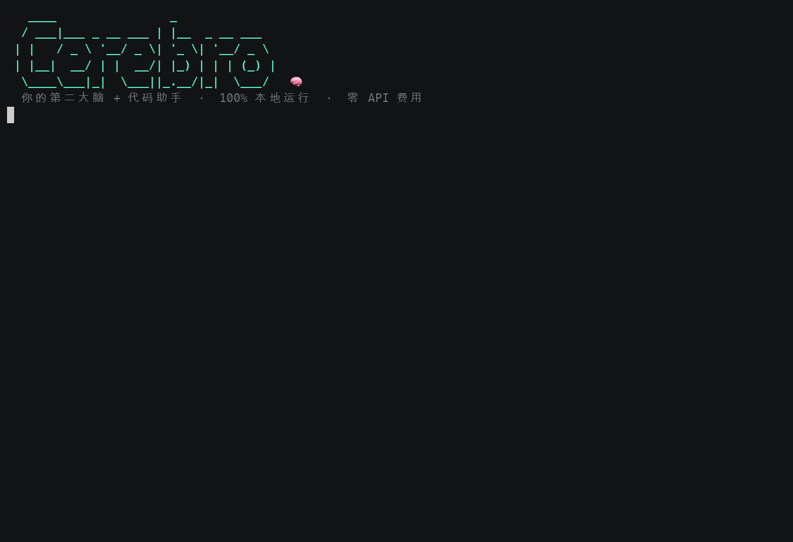
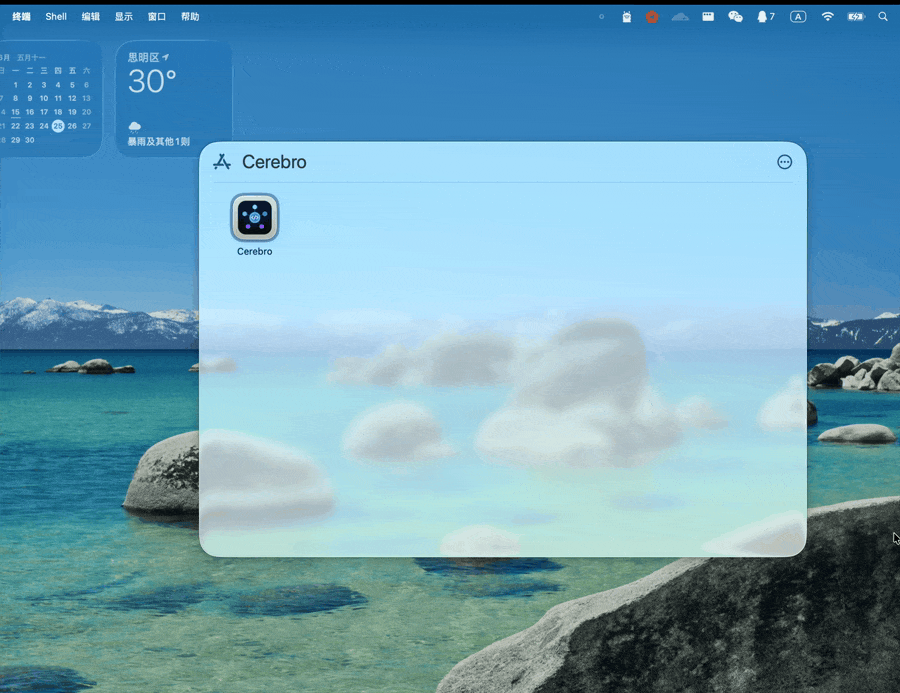

<div align="center">

# Cerebro 🧠

### 完全离线运行的「第二大脑」+ AI 代码助手 —— 数据不出本机，零 API 费用

[](LICENSE)
[](../../releases)
[](../../stargazers)
[](https://www.python.org/)
[](https://ollama.com)

[下载安装](#下载安装包普通用户推荐) · [快速开始](#快速开始开发者--源码运行) · [命令速查](#统一命令速查) · [环境变量](#环境变量表) · [模型选择](#模型选择要点) · [文档](#-文档资源)

</div>

> *Cerebro* —— 拉丁语「大脑」。一个**完全本地运行**的智能体：把你的 PDF、论文、笔记变成可检索的「第二大脑」，并让 AI 帮你读写代码、执行任务——**全程离线，数据不离开你的电脑**。

基于 **Ollama qwen3.5**（默认 `qwen3.5:4b`，可按机器配置一键切换，见[模型选择要点](#模型选择要点)），三合一融合：**📚 RAG 知识库检索** + **🤖 ReAct Agent 代码操作** + **🤝 多 Agent 协作系统**。

**为什么选 Cerebro？**

- 🔒 **隐私优先** —— 100% 本地推理，敏感文档与代码永不上传云端
- 💸 **零成本** —— 基于开源 Ollama，无需任何 API Key 或订阅费用
- 🧩 **三模式合一** —— 知识库问答、自动化代码 Agent、多 Agent 协作，一个工具全覆盖
- 📦 **开箱即用** —— 提供 Windows / macOS / Linux 桌面安装包，非开发者也能用

<div align="center">



<sub>三大模式一镜演示：📚 RAG 知识库问答 · 🤖 ReAct Agent 自动改代码跑测试 · 🤝 多 Agent 协作交付</sub>

</div>

---

## 下载安装包（普通用户推荐）

无需搭建 Python 环境，前往 [Releases](../../releases) 页面下载对应平台安装包：

| 平台 | 文件 | 安装方式 |
|------|------|---------|
| Windows | `Cerebro-Setup-x.x.x.exe` | 双击运行安装向导，按提示下一步即可 |
| macOS | `Cerebro-x.x.x.dmg` | 打开后将 Cerebro 拖入「应用程序」 |
| Linux | `Cerebro-x.x.x-x86_64.AppImage` | `chmod +x Cerebro-*.AppImage` 后双击运行 |

**运行前提**：应用依赖本地 [Ollama](https://ollama.com) 服务。首次启动会自动检测，
若未安装会引导你安装 Ollama 并拉取所需模型（`qwen3.5:4b`、`nomic-embed-text:latest`）。

**使用方式**：
- 直接运行 = 系统托盘桌面应用（GUI）
- 命令行交互模式 = 启动时加 `--cli` 参数（Windows 安装包已附「命令行模式」快捷方式）

<div align="center">



<sub>桌面应用：点击托盘图标 → 「打开 CLI 界面」→ 进入交互</sub>

</div>

> macOS 首次打开提示「无法验证开发者 / 已损坏」的处理步骤见 [桌面应用指南 §macOS 用户须知](docs/tutorials/05-desktop-app.md#macos-用户须知首次打开)。

---

## 快速开始（开发者 / 源码运行）

> 架构图与使用场景见 [项目概述](docs/tutorials/01-overview.md#融合架构)；完整安装步骤（含 OCR / Tesseract、依赖冲突处理）见
> [安装和配置指南](docs/tutorials/02-installation.md)；项目结构与模块 API 见 [开发者指南](docs/tutorials/09-development.md)。

### 0. 前置条件检查（推荐）

```bash
./scripts/check_prereqs.sh        # Linux/macOS（含 Ollama / 模型 / 依赖 / Tesseract 探测）
.\scripts\check_prereqs.ps1      # Windows PowerShell
```

### 1. 环境准备

```bash
# 安装 Ollama（如未安装）
curl -fsSL https://ollama.com/install.sh | sh

# 拉取模型（默认协同档 4b；内存宽裕可再拉 qwen3.5:9b，运行中用 /model 切换）
ollama pull qwen3.5:4b
ollama pull nomic-embed-text:latest
```

### 2. 安装依赖

依赖版本**已全部钉死**（`==`）。三份清单：`requirements.txt`（运行时）、`requirements-dev.txt`（测试 / 静态检查，内含前者）、
`requirements-build.txt`（PyInstaller 打包）；分工表、升级流程与依赖冲突处理见 [安装指南 §步骤5](docs/tutorials/02-installation.md#步骤5安装python依赖)。

**推荐方法：使用专用安装脚本（避免依赖冲突）**
```bash
./scripts/install_deps.sh      # Linux/macOS（会询问是否一并安装 OCR / 开发测试依赖）
.\scripts\install_deps.ps1     # Windows PowerShell
```

**标准方法：**
```bash
pip install -r requirements.txt          # 只运行产品
pip install -r requirements-dev.txt      # 开发者：运行时 + 测试/静态检查（一条命令装全）
```

OCR（扫描版 PDF / 图片）为可选功能，需要 `pytesseract` + 系统级 Tesseract；程序会自动探测三平台常见安装路径，
未安装时只提示不报错，安装方法见 [安装指南 §OCR](docs/tutorials/02-installation.md#ocr)。

### 3. 启动 CLI

**交互式模式**（推荐）：
```bash
# 带知识库启动
python query_interface.py --data ./data

# 纯 Agent 模式启动
python query_interface.py
```

**单次查询**：
```bash
# 知识库查询
python query_interface.py --data ./papers --query "实验结果是什么？"

# Agent 任务
python query_interface.py --agent "检查 main.py 的语法错误"
```

### 4. 启动 Web 界面

```bash
python launcher.py --web        # 默认 http://127.0.0.1:7860
```

左侧栏切换 **对话 / 知识库 / 知识图谱 / 工具 / 系统** 五个页面；对话页默认「自动」模式（按意图判定走 RAG 还是单 Agent），
工具页分 代码 / Git / 数据库 / 工作区 四个子页，功能面与 CLI 命令一一对应。各页面详解见
[功能说明 §Web 界面](docs/tutorials/04-features.md#10-web-界面)；三种模式（自动路由 / RAG / Agent / 多 Agent）的用法与
检索、安全、鲁棒性细节见 [功能说明 §三模式使用指南](docs/tutorials/04-features.md#11-三模式使用指南自动路由--rag--agent--多-agent)。

### 5. 桌面应用（托盘）

```bash
python launcher.py               # 系统托盘应用；--cli / --web 分别进入命令行 / Web，--skip-bootstrap 跳过环境检测
```

启动时会检测 Ollama（未装则引导安装、缺模型则引导拉取）并探测 Tesseract（缺失仅提示一次）。详见 [桌面应用使用指南](docs/tutorials/05-desktop-app.md)。

---

## 统一命令速查

| 命令 | 模式 | 说明 |
|------|------|------|
| `<自然语言>` | 自动 | 🆕 不加斜杠直接输入：按意图自动判定走 RAG 还是 Agent（`AUTO_ROUTE`） |
| `/auto` | 自动 | 🆕 显示自动路由状态（默认开） |
| `/auto on\|off` | 自动 | 🆕 运行时开关自动路由（关闭后自然语言一律走知识库问答） |
| `/ask <问题>` | RAG | 直接查询知识库（不做意图判定） |
| `/agent <任务>` | Agent | 进入 ReAct 自动任务模式 |
| `/multi <任务> [--mode m]` | MultiAgent | 多 Agent 协作（hierarchy / parallel / sequential / competitive） |
| `/add <路径>` | RAG | 添加文档到知识库 |
| `/stats` | RAG | 知识库统计 |
| `/sources` | RAG | 显示上次回答来源 |
| `/generate-skills` | RAG | 将知识库转化为Skills |
| `/snapshot-list` | RAG | 查看知识库快照 |
| `/snapshot-create` | RAG | 手动创建快照 |
| `/snapshot-restore <id> [--apply [--replace]]` | RAG | 生成恢复脚本；`--apply` 直接恢复（追加 / 替换） |
| `/snapshot-info <id>` | RAG | 🆕 快照详情（文档清单、文件是否仍存在） |
| `/snapshot-delete <id>` | RAG | 🆕 删除快照（确认） |
| `/snapshot-prune [N]` | RAG | 🆕 清理自动快照，仅保留最近 N 个 |
| `/knowledge-summary` | RAG | 查看知识库文档摘要 |
| `/file <路径>` | Agent | 快速读取文件 |
| `/write <路径>` | Agent | 交互式写入文件 |
| `/exec <命令>` | Agent | 执行命令（安全确认；high 风险即使开了自动确认也仍需确认） |
| `/search <关键字>` | Agent | 搜索代码文件 |
| `/tools` | - | 查看所有工具 |
| `/config` | - | 🆕 显示运行配置（模型 / LLM 后端 / 自动确认 / **允许读目录 · 允许写目录** / **Tesseract 探测结果** / 数据与索引目录） |
| `/history` | Agent | 对话历史 |
| `/summary` | Agent | 执行步骤摘要 |
| `/clear` | - | 清屏 |
| `/reset` | Agent | 重置对话上下文 |
| `/pwd` / `/cd` | - | 目录操作 |
| `/db-connect <database>` | - | 🆕 连接 SQLite 并设为当前连接（默认 sqlite；`/db-connect sqlite x.db` 仍兼容） |
| `/db-query <sql>` / `/db-execute <sql>` | - | 在当前连接上查询（🆕 结果表格，最多 50 行）/ 执行写语句（执行需确认） |
| `/db-schema [table]` | - | 🆕 表结构表（列 / 类型 / 约束）；不带参数列出当前库全部表 |
| `/db-create-table <table> <json>` / `/db-insert <table> <json>` | - | 建表 / 插入（JSON 参数，需确认） |
| `/git-analyze [history\|status\|authors]` / `/git-commit-gen` | - | 🆕 Git 概览表（分支 · 变更数 · 最近 10 次提交）/ 变更文件表 / 提交者表；AI 生成提交信息 |
| `/code-ast <pattern>` / `/code-quality <path>` | - | 符号搜索 / 代码质量检查 |
| `/web-search <query>` / `/web-extract <url>` / `/web-cache [status\|clear]` | - | 网络搜索 / 正文提取 / 缓存管理 |
| `/file-list` | - | 🆕 列出知识库中的所有文件 |
| `/file-info <path>` | - | 🆕 查看文件详细信息 |
| `/file-delete <path>` | RAG | 🆕 从知识库删除文件（向量 + 图谱来源 + 元数据，不删磁盘文件） |
| `/graph-summary` | - | 🆕 图谱概览（节点 / 边 / 类型分布） |
| `/graph-export [路径] [--3d\|--2d] [--focus 实体]` | - | 🆕 导出交互式 HTML 图谱并在浏览器打开 |
| `/file-cleanup` | - | 🆕 清理临时/重复文件 |
| `/file-deduplicate` | - | 🆕 手动触发去重 |
| `/file-stats` | - | 🆕 显示文件统计信息 |
| `/session-new [--carry] [title]` | - | 🆕 创建新会话（默认全新上下文；`--carry` 仅承接上一会话已压缩的滚动摘要） |
| `/session-list` | - | 🆕 列出所有会话 |
| `/session-switch <id>` | - | 🆕 切换到指定会话 |
| `/session-archive <id>` | - | 🆕 归档会话 |
| `/session-delete <id>` | - | 🆕 删除会话 |
| `/session-info <id>` | - | 🆕 查看会话详情 |
| `/session-search <query>` | - | 🆕 搜索会话 |
| `/session-current` | - | 🆕 显示当前会话信息 |
| `/session-compress` | - | 🆕 压缩当前会话历史 |
| `/model` | - | 显示当前模型（是否已加载、驻留大小、num_ctx、思考模式） |
| `/model list` | - | 🆕 列出本机已安装模型 |
| `/model <name>` | - | 🆕 运行时热切换模型并释放旧模型（如 `/model qwen3.5:9b`） |
| `/think` | - | 🆕 显示思考模式状态（默认关） |
| `/think on\|off` | - | 🆕 运行时开关思考模式（需模型支持，如 qwen3.5） |
| `/tutorial` | - | 使用教程 |
| `/help` | - | 帮助 |
| `/quit` | - | 退出 |

---

## 环境变量表

常用项速查（默认值以 `src/config.py` 为准）。带注释的完整版、`config.py` 对应常量、OpenAI 兼容后端接入示例与 OCR 细项见
[配置参考](docs/tutorials/08-configuration.md)。

| 变量 | 默认 | 说明 |
|---|---|---|
| `LLM_MODEL` | `qwen3.5:4b` | 全局唯一 LLM（RAG / Agent / 多 Agent 共用），运行中可 `/model <name>` 热切换 |
| `LLM_THINK` | `false` | 思考模式；关闭时 4B 模型 31s → 2.8s，可 `/think on` 运行中开启 |
| `LLM_STREAM` | `true` | 真流式输出：最终答案逐字出现、Ctrl+C / 「停止」立即关闭连接；`false` 回到整段输出 |
| `LLM_NUM_CTX` | 自动 | 按模型参数量推导（4B→16K，7~9B→8K，12B+→4K） |
| `LLM_PROVIDER` | `ollama` | 对话后端协议：`ollama` \| `openai`（vLLM / LM Studio / 内网网关，见[配置参考 §接入 OpenAI 兼容后端](docs/tutorials/08-configuration.md#接入-openai-兼容后端)） |
| `LLM_BASE_URL` | = `OLLAMA_BASE_URL` | 对话后端地址（openai 模式下带不带 `/v1` 均可） |
| `LLM_API_KEY` | 空 | openai 模式的 Bearer 令牌，本地服务留空 |
| `LLM_REASONING_EFFORT` | `none` | openai 模式 + 思考关闭时随请求发送的 `reasoning_effort`；后端不认识会自动去掉重试；设空不发送 |
| `OLLAMA_BASE_URL` | `http://localhost:11434` | Ollama 地址（嵌入模型始终走这里） |
| `OLLAMA_MAX_CONCURRENCY` | `2` | 进程内同时在途的 LLM 请求上限；多 Agent 并行时其余排队（不计入子任务超时）；`0` 不限制 |
| `EMBED_MODEL` | `nomic-embed-text:latest` | 嵌入模型（由 Ollama 提供） |
| `CHUNK_SIZE` / `CHUNK_OVERLAP` | `1024` / `200` | 文本分块大小 / 重叠 |
| `TOP_K` | `10` | 检索片段数 |
| `RAG_HYBRID` | `true` | 向量 + BM25 混合召回（`rank_bm25` 未装自动回退） |
| `RAG_HYBRID_MAX_CHUNKS` | `50000` | 超过即只用向量检索并在 `/stats` / Web 提示原因；BM25 常驻内存每万块约 100–150MB，8GB 机器建议 20000 |
| `RERANKER` / `RERANKER_MODEL` | `llm` / `BAAI/bge-reranker-v2-m3` | 逐片段 rerank 方式：`llm`（一次模型调用）\| `cross-encoder`（需 `sentence-transformers`） |
| `RAG_SELF_CHECK` | `false` | 综合后逐句自校验是否被资料支持（每问多一次调用） |
| `CODE_AWARE_CHUNKING` / `CODE_CHUNK_MAX_CHARS` / `CODE_CHUNK_MIN_CHARS` | `true` / `1500` / `120` | 代码按函数 / 类切分（缺 `tree-sitter-language-pack` 自动回退） |
| `AUTO_ROUTE` | `true` | 自然语言输入 / Web「自动」模式先判定走 RAG 还是 Agent（CLI `/auto on\|off`） |
| `CODE_AGENT_AUTO_CONFIRM` | `false` | 自动确认（等价 `--yes`）；**只放行 low / medium**，high 仍需确认，critical 始终拦截 |
| `WRITE_ALLOWED_DIRS` | 空 | `write_file` / 入库允许的额外目录（冒号分隔；当前工作目录始终允许） |
| `READ_ALLOWED_DIRS` | 空 | 读文件 / 目录工具允许的额外目录；实际允许读取 = 写允许目录 ∪ 本项 ∪ 已入库文档所在目录；`/config` 可查 |
| `MAX_ITERATIONS` / `TIMEOUT` | `50` / `300` | Agent 最大步数 / 模型超时（秒） |
| `MAX_FORMAT_RETRIES` / `OBSERVATION_MAX_CHARS` | `2` / `3000` | 单 Agent 格式错误重试次数 / 单条 Observation 最大字符数 |
| `CODE_AGENT_PROMPT_MODE` / `SYSTEM_PROMPT_EXTRA_MAX_CHARS` | `append` / `4000` | 系统提示分层：内置 → Skills → `prompts/system/PROJECT_RULES.md`（见 [prompts/README.md](prompts/README.md)） |
| `CODE_AGENT_SKILLS` / `SKILL_MAX_CHARS` / `AGENT_PROMPTS_DIR` | `on` / `4000` / 空 | Skills 层开关 / 总字符上限 / 额外 prompts 目录（冒号分隔） |
| `OCR_ENABLED` / `OCR_ENGINE` | `true` / `tesseract` | OCR 开关 / 引擎（`paddle` \| `tesseract`） |
| `TESSERACT_PATH` | 空 = 自动探测 | Tesseract 可执行文件；为空时按 `PATH` → 平台常见目录探测，未找到只提示不报错（[安装指南 §OCR](docs/tutorials/02-installation.md#ocr)） |
| `TESSERACT_LANG` | `chi_sim+eng` | Tesseract 语言包 |
| `RECOMMENDER_ENABLED` / `RECOMMENDER_MAX` | `true` / `5` | CLI 智能命令推荐开关 / 最大条数（另有 `RECOMMENDER_MIN_STRENGTH`、`RECOMMENDER_LEARNING`） |

```bash
export LLM_MODEL=qwen3.5:9b LLM_STREAM=true READ_ALLOWED_DIRS=~/Documents
python src/query_interface.py --data ./data
```

---

## 模型选择要点

Cerebro 采用「单一模型」架构：一个 LLM 同时驱动 RAG 综合、ReAct Agent 与多 Agent 协作，
全程只驻留一个模型。默认 **`qwen3.5:4b`（协同档）**：16K 上下文实测约 **3.7GB** 驻留，
可与 IDEA / PyCharm / 浏览器在 16GB 机器上并行运行；工具调用、中文归纳、长文本与代码
能力足以覆盖日常查询、报告分析、文件整理、SQL 查询与简单重构。

### 按场景推荐

| 场景 | 内存 | 推荐模型 | 说明 |
|---|---|---|---|
| **日常助手，与 IDE/浏览器并行（默认）** | 16GB | `qwen3.5:4b` | 约 3.7GB 驻留，M4 实测 ~25 tok/s |
| 专注模式 / 复杂重构 / 多步 Agent | 16GB（关闭 IDE）或 32GB | `qwen3.5:9b` | 约 6GB 驻留，~16 tok/s；工具调用（BFCL 66 vs 50）、SWE-Bench（53 vs 39）明显更强 |
| 低配 / 老机器 | 8GB | `qwen3.5:2b` | 约 1.9GB，适合问答与检索 |
| 工作站 | 32GB+ 或 24GB 显卡 | `qwen3.5:27b` / `gemma4:26b` | 17~19GB |
| 严格格式化输出 / 翻译为主，不依赖工具调用 | 16GB（关闭 IDE） | `gemma4:12b-it-qat` | 指令遵循最强（IFEval 94.8），但工具调用偏弱（BFCL 37） |
| Embedding（所有场景） | — | `nomic-embed-text:latest` | 固定 |

> 基准分数来自各模型官方页公开的模型卡数据；吞吐/驻留为 Apple M4 MacBook Air 16GB 实测。

### 三种切换方式

```bash
# 1) 启动时指定
python src/query_interface.py --model qwen3.5:9b

# 2) 环境变量
export LLM_MODEL=qwen3.5:9b

# 3) 运行中热切换（CLI）—— 同步 RAG/Agent/多 Agent，并立即释放旧模型
/model            # 查看当前模型、是否已加载、驻留大小
/model list       # 列出本机已安装模型
/model qwen3.5:9b # 切换
```

Web：「系统 → 模型」页下拉切换、勾选「思考模式」即时生效。小模型的过度顺从风险与评测脚本、与 IDE 共存的内存实践、
关注中的模型见 [配置参考 §模型选择指南](docs/tutorials/08-configuration.md#模型选择指南补充)。

---

## 📚 文档资源

教程索引 [docs/tutorials/README.md](docs/tutorials/README.md) 列出了每篇教程的内容与从 README 迁出的章节；常用入口：

| 想了解 | 去哪里 |
|---|---|
| 架构图、使用场景、技术栈 | [01 项目概述](docs/tutorials/01-overview.md) |
| 安装步骤、OCR / Tesseract、前置条件检查 | [02 安装和配置指南](docs/tutorials/02-installation.md) · [§OCR](docs/tutorials/02-installation.md#ocr) |
| 实战场景 | [03 实战场景示例](docs/tutorials/03-scenarios.md) |
| Web 各页详解、三模式使用指南、高级用法、快照 / Skills / 内容安全 | [04 详细功能说明](docs/tutorials/04-features.md) |
| 桌面托盘应用、macOS 首次打开 | [05 桌面应用使用指南](docs/tutorials/05-desktop-app.md) |
| 依赖冲突、遥测 / 警告、常见问题 | [06 故障排除指南](docs/tutorials/06-troubleshooting.md) |
| 知识库管理、Agent 任务设计、性能优化 | [07 最佳实践指南](docs/tutorials/07-best-practices.md) |
| `config.py` 注释、OpenAI 兼容后端、模型选择补充、OCR 配置 | [08 配置参考](docs/tutorials/08-configuration.md) |
| 项目结构、模块 API、测试与 RAG 检索基准 | [09 开发者指南](docs/tutorials/09-development.md) |
| 测试设计与运行、内容安全扫描器 | [TEST_DESIGN.md](docs/development/TEST_DESIGN.md) · [TESTING.md](TESTING.md) · [CONTENT_SECURITY.md](docs/development/CONTENT_SECURITY.md) |
| 功能实现记录、路线图、AI 编码助手项目知识 | [docs/README.md](docs/README.md) · [ROADMAP.md](docs/features/ROADMAP.md) · [ai-assistant/](docs/development/ai-assistant/README.md) · [AGENTS.md](AGENTS.md) |

---

*Cerebro — 你的第二大脑 + 代码助手 🧠💻*
