# F10: 工程加固与体验升级（安全 · 发布 · 流式 · 后端抽象 · 评测 · 规模化 · 拆分）

## 实施状态

**进行中**（P0-1 / P0-2 / P1-1 / P1-2 / P1-3 / P2-1 / P2-2 已完成 2026-09-09；P3-1 / P3-2 待实现） · 立项 2026-09-08 · 分支 `docs/f10-hardening`
· 目标：针对项目评估发现的 7 类结构性问题，按"用户可感知价值 × 复杂度"分 P0–P3 九个独立任务逐项落地（P3-2 为 P2-2 实施后追加的遗留项）

| 编号 | 主题 | 价值 | 复杂度 | 依赖 | 状态 | 完成日期 | 提交 |
|---|---|---|---|---|---|---|---|
| P0-1 | 命令安全分级修正（token 级匹配）· 读路径边界 · `AUTO_CONFIRM` 不放行 high · 两端显示允许目录 | 高 | 低 | — | **已完成** | 2026-09-09 | 见下方实现记录 |
| P0-2 | 依赖钉版本 + `requirements-dev.txt` · CI PR 触发 + 三平台矩阵 · CHANGELOG 归档 v0.1.0 | 高 | 低 | — | **已完成** | 2026-09-09 | 见下方实现记录 |
| P1-1 | 真流式输出（Ollama NDJSON → Web token 事件 / CLI rich Live）· `LLM_STREAM` 开关 · 可中断 | 高 | 中 | — | **已完成** | 2026-09-09 | 见下方实现记录 |
| P1-3 | RAG 评测集（38 例 + 18 文档小语料）· `src/rag_eval.py` 指标 · `scripts/eval_rag.py` 报表与 Δ · 两份 hybrid 基线 | 中 | 中 | — | **已完成** | 2026-09-09 | 见下方实现记录 |
| P1-2 | `src/llm_client.py` 后端抽象（Ollama / OpenAI 兼容）· 五处直连替换 · 模型列表 / 健康检查 | 中 | 中高 | P1-1 | **已完成** | 2026-09-09 | 见下方实现记录 |
| P2-1 | BM25 持久化增量（`bm25_store`）· 混合检索关闭可见 · RLock 补齐 · Ollama 并发信号量 | 中 | 中高 | P1-2 / P1-3（可选） | **已完成** | 2026-09-09 | 见下方实现记录 |
| P2-2 | 入口层拆分：`web/services/`、`web/handlers/` + `formatters.py`、`cli/handlers/` + `cli/parser.py`（纯重构） | 低（间接） | 高 | P1 全部合入 | **已完成** | 2026-09-09 | 见下方实现记录 |
| P3-1 | Tesseract 跨平台探测与缺失提示 · README 瘦身到 ≤400 行 | 低 | 低 | — | 待实现 | | |
| P3-2 | `query_interface.py` 二次拆分：`cli/state.py` 收口模块级状态 · `cli/{render,callbacks,rag_adapter,recommend,engine_commands}.py` · 223 处测试打桩目标迁移（纯重构，P2-2 遗留） | 低（间接） | 中 | P2-2 | 待实现 | | |

## 文档导读

| 文件 | 内容 | 适合 |
|---|---|---|
| [REQUIREMENTS.md](REQUIREMENTS.md) | 需求分项与验收标准；§0 为立项时核实的代码事实（带 `文件:行号`，按问题分 8 小节）；§5 两端规范；§6 实施顺序 | 了解"要做什么、为什么" |
| 本文件 | 实现记录（每项做了什么、落在哪个模块）、与需求的差异、验证结果、性能前后对比 | 了解"实际做成了什么" |
| [PROMPT.md](PROMPT.md) | 交给 Agent 的启动提示词，按九个任务分段、各自可独立粘贴 | 分批派发实现任务 |

用户可感知的变更同步记录在 [CHANGELOG.md](../../../CHANGELOG.md) `[Unreleased]` 与主 [README](../../../README.md) 对应段落。

## 立项背景

2026-09-08 对项目做整体评估（架构 / 代码规模 / 工程质量 / 依赖 / 安全 / 可扩展性），归纳出 7 类问题：

| # | 问题 | 用户可感知影响 | 对应任务 |
|---|---|---|---|
| 1 | 入口层 5 个文件 1400–2700 行，Web / CLI 双份呈现层 | 改一端漏一端；定位成本高 | P2-2 |
| 2 | 只支持 Ollama `/api/chat`；全部调用非流式，Web 为线程 + 心跳伪流式 | 长回答全程只见"思考中"；无法接入 vLLM / LM Studio / 内网网关 | P1-1、P1-2 |
| 3 | 命令安全靠子串黑名单（`"rm" in cmd`）；读操作无路径边界；`AUTO_CONFIRM` 可绕过 high | `pip show models` 被判高风险弹确认；可读工作区外任意文件 | P0-1 |
| 4 | BM25 每次全量拉取重建；`lock = None`；多 Agent 并行打爆单卡 Ollama | 大库入库卡顿、>2 万块静默降级、并行超时 | P2-1 |
| 5 | 依赖几乎未钉版本；104 条变更未发版；CI 单平台、仅 push master | 新用户安装失败；两个月成果无安装包 | P0-2 |
| 6 | 无 RAG 评测集；ReAct / rerank / 分解全靠 4B 模型结构化输出 | 改阈值后质量回归不可见 | P1-3 |
| 7 | Tesseract 路径 macOS 硬编码；README 1322 行 | Linux / Windows OCR 路径错误；新用户找不到入口 | P3-1 |

排序原则：两端共有的功能性缺陷（3、5）> 影响主路径的体验（2、6）> 规模化与可维护（4、1）> 收尾（7）。详细事实与行号见 [REQUIREMENTS.md §0](REQUIREMENTS.md#0-背景已核实的代码事实实施时勿重复调研)。

## 实施顺序

```
P0-1 安全分级 → P0-2 钉版本 + 发版 + CI
P1-1 真流式 → P1-3 RAG 评测（先建基线）→ P1-2 后端抽象
P2-1 BM25 + 锁 + 限流 → P2-2 入口层拆分
P3-1 Tesseract + README → P3-2 query_interface 二次拆分（P2-2 遗留）
```

## 实现记录

### P0-1 命令安全分级修正 + 读路径边界（2026-09-09）

| 子项 | 实现位置 | 做了什么 |
|---|---|---|
| P0-1-a token 级匹配 | `src/agent_tools.py` `CommandSafetyChecker` | 新增分词与判定纯函数：`_tokenize`（`shlex.shlex(posix=True, punctuation_chars=True)`，`ValueError` 回退 `re.split(r"\s+")`）、`_split_subcommands`（按 `|` `||` `&&` `;` `&` 切分）、`_head`（剥 `TRANSPARENT_PREFIXES` = sudo/doas/env/xargs/nohup/time/command/builtin/exec/nice/ionice 及其带值选项 `PREFIX_FLAGS_WITH_VALUE`、跳过 `VAR=value`、取 basename 转小写）、`_sql_risk`、`_subcommand_risk`（含 `-c`/`-e` 载荷递归，深度 ≤2）、`keyword_risk`、`is_readonly_command`。关键字集合：`HIGH_COMMANDS`（rm rmdir del erase rd drop truncate format mkfs shred）、`MEDIUM_COMMANDS`（mv cp chmod chown tee dd）、`MEDIUM_COMMANDS_WITH_FLAG`（`sed` + `-i`）、`SQL_CLIENTS` / `SQL_HIGH_KEYWORDS` / `SQL_MEDIUM_KEYWORDS`。`analyze` 中两处 `kw in command.lower()` 替换为 `keyword_risk()`；只读判定改为「全部子命令都命中 `READONLY_PATTERNS`」。`DANGEROUS_PATTERNS` / `HIGH_PATTERNS` / `MEDIUM_PATTERNS` / `READONLY_PATTERNS` 一字未改。 |
| P0-1-b 读边界 | `src/agent_tools.py`、`src/config.py` | 新增 `READ_ALLOWED_DIRS_ENV`、`read_allowed_dirs()`（写允许目录 ∪ `READ_ALLOWED_DIRS` ∪ `_indexed_document_dirs()`）、`is_read_allowed()`、`read_scope_error()`；抽出 `_normalize_dirs()` / `_within()` 供读写共用（`is_path_allowed` 改为复用）。`read_file` / `list_directory` / `search_files` 在 `expanduser` 后立刻校验。`config.py` 新增 `READ_ALLOWED_DIRS` 常量与 `Config.READ_ALLOWED_DIRS`。三个工具描述末尾加「（仅限允许目录）」。 |
| P0-1-c AUTO_CONFIRM 降权 | `src/agent_tools.py`、`src/react_engine.py`、`src/query_interface.py`、`src/cli_handlers.py`、`src/agents/base_agent.py` | 共享层新增 `AUTO_CONFIRM_RISK_LEVELS = ("low","medium")`、`HIGH_RISK_CONFIRM_HINT`、`auto_confirm_allows(safety)`（`safety` 为空 → True，`is_dangerous` → False）。`react_engine` 确认分支与 `registry.execute` 的 `auto_confirm` 均经该闸门；`query_interface.handle_exec` 同理并在 AUTO_CONFIRM 下打印提示；`cli_handlers._confirm` 增加 `safety=` 形参（默认 None，行为不变），`handle_db_execute` 经新增的 `_sql_safety(sql)` 传入；`base_agent.AUTO_CONFIRM_RISK_LEVELS` 改为引用共享常量，消除两处漂移。 |
| P0-1-d 两端展示 | `src/cli_handlers.py`、`src/query_interface.py`、`src/web/services.py`、`src/web/app.py` | 新增 CLI `/config`：`config_rows()`（纯函数，返回 `(标签, 值)` 列表）+ `handle_config`，注册进 `COMMAND_HANDLERS["config"]`、`parse_command` 与 `classify_mode`；同步 `print_help` 与 `TUTORIAL_TEXT`。Web：`WebService.env_info()` 增加 `read_allowed_dirs` / `write_allowed_dirs`，`format_env_info` 增加「允许读目录 / 允许写目录」两行（新增 `_fmt_dir_list`，超 6 个折叠），自动确认一行改为「开（只放行 low / medium）」。 |
| P0-1 后续（同日第二次提交）| `src/agent_tools.py`、`src/web/services.py`、`src/web/app.py`、`.flake8` | **读边界补全两端**：`analyze_project_structure` / `ast_search` / `code_quality_check` / `git_analyze` / `git_commit_gen` 接 `is_read_allowed`；Web 新增 `WebService.path_read_error(path)` 复用同一判定，约束 `list_dir` / `file_preview` / `search_in_dir` / `code_symbols` / `code_quality_report` / `graph_build_file` / `code_assist_stream`；`app.on_dir_search` 越界先报错（`search_in_dir` 无 error 槽位，否则会伪装成"未找到"），`on_file_edit_load` 越界不再提示"保存将创建新文件"。**允许目录收敛**：`_normalize_dirs` 丢弃被包含的子目录；`_indexed_document_dirs` 把 Gradio 上传根（`$GRADIO_TEMP_DIR` / `<tmp>/gradio`）下的哈希目录折叠为根一条。**守卫测试**：真实 registry 下 high 命令确认一次即执行一次（不再二次 `[CONFIRM_REQUIRED]`）。**flake8**：`.flake8` 的 `ignore` 行内注释导致 flake8 根本跑不起来（`ValueError`），移到独立行；顺手删掉 5 处只读的死 `global` 声明（F824），为 P0-2-b 的阻断门禁留出干净基线。 |

### P2-2 入口层拆分（纯重构，行为零变化）（2026-09-09）

按 a → b → c → d 顺序四次提交，每次提交前全量测试通过；**没有改任何业务逻辑、文案或 bug**，所有改动都是"整段移动 + 补 import + 兼容重导出"。

| 子项 | 实现位置 | 做了什么 |
|---|---|---|
| P2-2-a services 拆包 | **新增** `src/web/services/{__init__,base,chat,knowledge,tools,db,graph,system}.py`；**删除** `src/web/services.py` | `base.py`：模块级引擎工厂 `_default_*`、`ScratchContext`、`StreamEvent`、`_DONE`、`class WebServiceBase`（原 `WebService` 的 `__init__` / 工具页持久状态 / 任务生命周期与取消 / 交互式确认 / `_token_sink` / `_bridge` / 三个惰性单例属性）。六个 mixin 按原文件的 `# ----------` 分段整段搬移：`ChatMixin`（会话上下文、RAG / 单 Agent / 自动路由 / 多 Agent、会话管理、连续对话上下文、会话高级）、`KnowledgeMixin`（知识库管理 ×2、文件管理、快照，含 `_describe_chunking`）、`ToolsMixin`（registry 工具命令、代码助手 / 符号 / 质量、Git、AI 解读、工具清单 / Shell / 文件读写 / 工作目录、工作区浏览、命令生成、`env_info` 之外的系统项）、`DatabaseMixin`（需求列的 5 个之外单拆，见差异 #1）、`GraphMixin`（图谱查询 / 构建 / 可视化数据）、`SystemMixin`（模型热切换 / 思考模式 / `env_info`，含 `_code_chunking_env_text`）。`__init__.py`：`class WebService(ChatMixin, KnowledgeMixin, ToolsMixin, DatabaseMixin, GraphMixin, SystemMixin, WebServiceBase)` + 原文的 `_web_service_singleton / get_web_service / reset_web_service` + 重导出全部原公开名（含 `_default_*`、`_describe_chunking`、`_code_chunking_env_text`、`logger`）。唯一的代码改动：`base.py` 里 `from .tools_state` → `from ..tools_state`（包层级加深一层）。 |
| P2-2-b app 拆包 | **新增** `src/web/formatters.py`、`src/web/handlers/{__init__,chat,knowledge,tools,graph,system}.py`；`src/web/app.py` 2821 → **244 行** | `formatters.py`：原 `app.py` 第 14–1457 行整段（`MODE_AUTO` / `CARRIED_TITLE` / `conversation_context` 的 4 个重导出、`ProgressTracker`、`component_update` / `_noop` / `_starts_new_round`、全部 `format_*` / `*_rows` / `*_HEADERS` / `build_graph_figure` …），另把 `build_handlers` 里的闭包 `_fmt_result` 提为模块级函数（五个 handler 组都要用）。`handlers/<页>.py`：`build_<页>_handlers(service) -> dict`，各段 `on_*` 闭包原样搬入，带表头的组在返回 dict 里附 `"headers"` 子字典；`__init__.py` 重导出五个工厂。`app.py`：`build_handlers` 依次调用五个工厂、`update` 合并并把 `headers` 合成一个子字典——**返回结构（键集合、`headers` 键集合）与拆包前逐一比对相同**（拆分脚本内置断言）；`build_app / serve_blocking / launch / main` 原样；顶部 `from .formatters import (...)` 重导出 `formatters` 全部 102 个名字。 |
| P2-2-c CLI 拆包 | **新增** `src/cli/{__init__,parser,help_text}.py`、`src/cli/handlers/{__init__,base,agent,system,knowledge,files,session,tools,git,db}.py`；`src/cli_handlers.py` 2183 → **38 行** shim；`src/query_interface.py` 2274 → **1799 行** | `cli/handlers/`：按原文件 `# ====` 分段整段搬移（`base` = CLIContext / `_is_error` / `_confirm` / `_sql_safety` / `LiveAnswer`；`agent` = `/multi`；`system` = `/help /tutorial /tools /config`；`knowledge` = 知识库基础 + 管理命令；`files`；`session`；`tools` = 网络搜索 / 代码分析 / 知识图谱；`git`；`db`），跨模块引用自动补 `from .base import _confirm` 等；`__init__.py` 重导出全部 81 个名字并放原文 `COMMAND_HANDLERS`。`cli_handlers.py` 改为 `from cli.handlers import *` + 显式列出全部下划线名。`cli/parser.py`：`ParsedCommand / parse_command / classify_mode` 原文（纯函数，零外部依赖）。`cli/help_text.py`：`TUTORIAL_TEXT` 原文 + `print_help(console=None, has_rich=False)`，`/help` 文案作为函数体内局部 `help_text` 原样保留（见差异 #3）。`query_interface.py`：三段替换为 `from cli.help_text import TUTORIAL_TEXT / print_help as _print_help`、`from cli.parser import ParsedCommand, classify_mode, parse_command`（重导出）、`def print_help(): _print_help(console, HAS_RICH)`；四处 `from cli_handlers import` 改为 `from cli.handlers import`。 |
| P2-2-d 配套 | `packaging/cerebro.spec`、`pytest.ini`、`src/desktop_app.py` | spec 的 `hiddenimports` 本就对 `src/` 每个子包 `collect_submodules(sub.name)` 递归收集，`web.services.* / web.handlers.* / web.formatters / cli.*` 自动覆盖（已用 `collect_submodules` 实测：web 27 个、cli 13 个模块），只补注释说明；`pytest.ini` omit 仍为 `*/src/web/ui/*`（路径未变，无需改）；`desktop_app` 的状态探测在 P1-2 已改为 `LLMClient.health / list_models`，本次无改动。 |
| 测试 | `tests/test_web_kb_management.py`、`tests/test_cli_handlers_{context,database,graph,rich_tables,multi}.py`、`tests/test_streaming_p1_1.py` | **零断言改动**，只改 13 处打桩 / 取源目标的导入路径：`patch.object(web_app, "build_graph_figure")` → `patch("web.handlers.graph.build_graph_figure")`（2 处：闭包现在从 `web.handlers.graph` 的模块全局取名）；`monkeypatch.setattr(cli_handlers, "_get_session_manager")` → `cli.handlers.session`（4 处）、`h._db_results` / `h.DB_QUERY_MAX_ROWS` → `cli.handlers.db`（3 处）、`h._git_overview` → `cli.handlers.git`（4 处）；`inspect.getsource(print_help)` → `cli.help_text.print_help`（2 处）。原因：shim 模块里的名字只是引用副本，patch 它不影响实现模块内的查找。 |
| 文档 | `CHANGELOG.md`、`AGENTS.md`、`README.md`、`docs/development/ai-assistant/{ARCHITECTURE,MODULE_GUIDES,CODE_STANDARDS,WORKFLOWS}.md` | CHANGELOG `[Unreleased]` 改进一条；AGENTS 目录职责表加 `src/web/` `src/cli/` 两行、"两端入口"与 `help_text` 指引改为新路径；README 项目结构树加 `cli/` `web/` `cli_handlers.py`；ARCHITECTURE §1 分层图 + 新增 §1.1 入口层内部结构表 + 扩展点表两行；MODULE_GUIDES 入口层三节重写；CODE_STANDARDS §1 加入口层文件规模上限与"新代码从实现模块导入 / patch 目标为实现模块"规则、§6 单例位置；WORKFLOWS §6 改 Web UI 路径。 |

拆分前后行数：

| 文件 | 拆分前 | 拆分后 | 上限 |
|---|---|---|---|
| `src/web/app.py` | 2821 | **244** | ≤300 ✓ |
| `src/web/services.py` → `src/web/services/` | 2693 | `__init__` 76 · `base` 435 · `chat` 617 · `knowledge` 542 · `tools` 666 · `db` 195 · `graph` 127 · `system` 171（合计 2829） | 单文件 ≤800 ✓ |
| `src/web/formatters.py`（新） | — | 1462 | 需求未设上限（纯函数集合） |
| `src/web/handlers/`（新） | — | `chat` 566 · `knowledge` 315 · `tools` 354 · `graph` 90 · `system` 98 · `__init__` 19（合计 1442） | 单文件 ≤800 ✓ |
| `src/query_interface.py` | 2274 | **1799** | ≤800 ✗（见差异 #2；剩余拆分立项为 P3-2） |
| `src/cli_handlers.py` → `src/cli/handlers/` | 2183 | shim 38；`__init__` 176 · `base` 176 · `agent` 129 · `system` 99 · `knowledge` 421 · `files` 218 · `session` 300 · `tools` 428 · `git` 160 · `db` 243（合计 2350） | 单文件 ≤600 ✓ |
| `src/cli/parser.py` / `src/cli/help_text.py`（新） | — | 252 / 251 | — |
| `src/desktop_app.py` | 1471 | 1471（本期不拆） | — |

### P1-1 真流式输出（2026-09-09）

| 子项 | 实现位置 | 做了什么 |
|---|---|---|
| P1-1-a 引擎层 | `src/react_engine.py` | `_call_model(messages, num_predict, think, on_token=None)`：`on_token` 为空时请求体 `stream: False`、调用形态与旧版完全一致；非空且 `Config.LLM_STREAM` 时 `requests.post(..., stream=True)` → `_consume_stream`（委托共享层 `consume_ndjson_stream`，`should_stop=_stop_event.is_set`），读取期间把响应挂在 `_active_response`；`LLM_STREAM=false` 时非流式并把完整文本一次性回调。`ReActEngine.__init__(on_token=)` / `chat(task, on_token=None)`（`chat` 参数优先）；每轮经 `_call_model_streaming()` 包一层新增的 **`FinalAnswerStream`**：缓冲到看见 `Final Answer:` 才转发其后增量（首段 `lstrip`），缓冲区出现 `Action:` 则丢弃本轮——用户不会看到 `Thought / Action` 协议文本闪现。`_forced_summary` 同样经该包装。`stop()` 置位后调用 `llm_helper.abort_response(_active_response)`。`chat` 在 `_call_model` 返回后再查一次 `_stop_event`，被中断的半截文本不进 `_parse_response`。协议与 `_parse_response` 一字未改。 |
| P1-1-a 共享层 | `src/collaboration/llm_helper.py` | `complete_text(..., on_token=None, should_stop=None)` 同一套开关语义；新增 `consume_ndjson_stream(resp, on_token, should_stop)`（空行 / 非 JSON 行忽略，`{"error"}` 抛 `RuntimeError`，`done` 结束，`should_stop` 为真即停止回调并关闭响应，响应总会被关闭）与 `abort_response(resp)`（先 `resp.raw._fp.fp.raw._sock.shutdown(SHUT_RDWR)` 再 `close()`；只 `close()` 在 macOS 上不会唤醒阻塞在 `recv` 的读线程）。 |
| P1-1-a RAG 综合 | `src/rag_pipeline.py` | 新类型 `TokenCallback`；`answer_question(..., on_token=None)` → `_answer_question_planned` → `generate_answer(..., on_token=None)` → `_generate_answer_inner` 内四处最终综合调用统一走局部 `synthesize(prompt)`：无 `on_token` 时仍是 `llm_direct_answer(prompt)` 单参调用（现有 `lambda p:` 桩全部兼容），有则 `llm_direct_answer(prompt, on_token, should_stop)` → `_complete(prompt, on_token, should_stop)` → 新增 `_stream_complete`：`Settings.llm.stream_chat([ChatMessage(user)])` 逐 `delta` 回调，`should_stop` 为真 `break` 并 `gen.close()`，末块经现有 `_emit_thinking` 透出思维链；LLM 无 `stream_chat` 时回退一次性补全 + 单次回调。规划 / rerank / 自校验等工具性调用不流式。 |
| P1-1-a 多 Agent 整合 | `src/collaboration/result_integrator.py`、`src/master_agent.py`、`src/agent_orchestrator.py` | `ResultIntegrator.on_token` 属性（未注入 `complete` 时 `_synthesize_answer` 用 `complete_text(prompt, on_token=...)`）；`MasterAgent.coordinate_task(..., on_token=None)` 进入时注入、`finally` 复位；`AgentOrchestrator.process_request(..., on_token=None)` 仅在非空时透传（`kwargs` 形态与 `progress` / `context` 一致）。子任务执行不流式。 |
| P1-1-b 配置 | `src/config.py` | `LLM_STREAM = env LLM_STREAM（默认 true，1/true/yes/on）` 与 `Config.LLM_STREAM`。 |
| P1-1-c Web 服务层 | `src/web/services.py` | `StreamEvent` 文档注释补 `token` / `confirm`；新增 `WebService._token_sink(q, cancel)`（取消后丢弃增量）；`rag_query_stream` 把它传给 `answer_question(on_token=)`，`agent_chat_stream` 传给 `engine.chat(user_input, on_token=)`，`multi_agent_stream` 经 `_run_orchestrator(..., on_token=)` 透传；`chat_auto_stream` 原样转发子流的 `token`。`_bridge` 逻辑不变（`queue.get(timeout=heartbeat_interval)` 天然做到"只在无任何事件时发心跳"），文档注释明确。`stop_current` → `engine.stop()` 现在会关闭流式连接。 |
| P1-1-c Web 呈现层 | `src/web/app.py` | `on_chat_stream` 新增 `partial` 缓冲：`token` 事件逐段拼接为"正在生成"的助手气泡并把状态行设为「✍️ 生成回答中…」；`answer` 到达后以完整文本（含 notices / 引用校验后处理）替换；新增 `_starts_new_round(kind, data)`——非心跳的 `thinking` step 到来时清空 `partial`（极少数"先写 Final Answer 又写 Action"的轮次）；生成期间 transient 心跳不再覆盖状态文案；`cancelled` 时保留已流出的部分回答并追加「> ⏹️ 已停止，以上为中断前的部分回答」。 |
| P1-1-d CLI | `src/cli_handlers.py`、`src/query_interface.py` | 新增 **`LiveAnswer`**（`rich.live.Live(Panel(Markdown(buffer)), refresh_per_second=8, transient=True)`，首个 token 才启动，`finish()` 停止并清除实时区域；类级 `LiveAnswer.streaming()` 标志；非 Rich 终端为空操作）。`_run_ask`（`/ask` 与自然语言）传 `on_token=live.on_token`，`KeyboardInterrupt` → `live.finish()` + 打印「已中断，已关闭与模型的连接。」；`handle_agent` 以 `engine.on_token = live.on_token` 方式注入（结束后恢复，`engine.chat(task)` 调用形态不变），`Ctrl+C` → `engine.stop()`（关闭连接）+「已中断：…」；单次 `--agent` 同理；`handle_multi` 传 `on_token`（仅整合阶段有 token）。`on_step_callback` 在 `LiveAnswer.streaming()` 时静默 transient 推理心跳（否则 `\r` 单行刷新会在面板上方反复刷出）。Live 面板为 transient：完成后仍按既有格式打印完整答案 + 来源 + notices，最终输出与非流式完全一致。`print_help`（`/ask` `/agent` 行）与 `TUTORIAL_TEXT`（新增"流式输出"示例段）同步。 |
| P1-1-e 文档 | `README.md`、`CHANGELOG.md`、`docs/development/ai-assistant/ARCHITECTURE.md` §2.6、`MODULE_GUIDES.md` | 环境变量表加 `LLM_STREAM`（配置块 + export 示例）；CHANGELOG `[Unreleased]` 新增「真流式输出」、改进「回答可中断」；ARCHITECTURE 新增 §2.6「流式回调路径」；MODULE_GUIDES 更新 `ReActEngine` 签名、`llm_helper` 新函数、`StreamEvent` kinds。 |

### P1-3 RAG 评测集与基准脚本（2026-09-09）

| 子项 | 实现位置 | 做了什么 |
|---|---|---|
| P1-3-a 语料与样本 | **新增** `tests/fixtures/rag_eval_corpus/`（18 个文件）、`tests/fixtures/rag_eval_cases.json`（38 条） | 语料是一个**虚构的任务调度库 Lumen** 的文档与代码：13 个 md（简介 / 安装 / 配置表格 / 调度器设计 / 重试策略 / 存储后端 / CLI 参考 / FAQ / 发布说明 / 安全 / 指标）、2 个 txt（术语表 / 错误码排查）、5 个 py（`scheduler.py` / `retry.py` / `storage.py` / `worker.py` / `cli.py`，含类 / 函数 / 模块常量），总量 **36 KB**，无隐私、不依赖外部包（`import redis` 在未执行的分支内）。同一事实刻意在多个文件重复出现（如 9464 端口、`lumen:dead`、`3.11`）以制造多跳与"多个正确来源"的情形。样本 `{id, question, type, expected_files, expected_keywords, notes}`：**single 15 / multi_hop 7 / code_symbol 7 / meta 4 / negative 5**；`expected_files` 列出所有直接含答案的文件（Recall 取标准定义）；`expected_keywords` 支持 `a\|b` 同义可选；negative 选"会召回相近文档但语料确实没有答案"的问题（Kafka 后端 / iOS 客户端 / 3.0 发布日 / GPU / 企业版价格）。 |
| P1-3-b 打分纯函数 | **新增** `src/rag_eval.py` | `recall_at_k(sources, expected_files, k)`、`mrr`、`citation_hit_rate(answer, sources, expected_files)`（`cited_refs` 解析 `[n]`、忽略代码块 / `[W1]` / `[?]`；`resolve_citation` 优先按来源 `ref` 键、都没有时按位置，越界为 None 计未命中）、`keyword_hit`（`norm_text` 归一化 + `\|` 可选项）、`negative_rejected(answer, sources)`（无来源 / 空答案 / 含 `REJECT_WORDS`）、`evaluate_case(case, retrieval_sources, answer_result, k, latency, error)` → 明细行（含 `passed` 判定、`retrieved` / `cited_files`）、`aggregate(rows)`（按 type 分组均值 + overall，None 不计）、`render_markdown(agg, meta, previous=None, rows=None)`（运行信息表 + 汇总表 + 逐例表 + 指标说明；有 `previous` 时每格附 `(+0.05)` / `(-1.5s)` / `(±0.00)` Δ 与「对比基线」行）。样本工具 `load_cases / type_distribution / validate_cases`。**F9-1 的 `HEDGE_WORDS / PREMISE_WORDS / HOLD_WORDS` 迁到这里作唯一定义**，`scripts/eval_overcompliance.py` 改为 `from rag_eval import …`（其单测不改）。 |
| P1-3-c 脚本 | **新增** `scripts/eval_rag.py`；`src/rag_engine.py` | `--hybrid on\|off --rerank llm\|cross-encoder\|none --top-k N --tag NAME [--cases] [--corpus] [--out-dir] [--limit] [--type] [--model] [-v] [--debug]`，未给的参数取 config 默认（`RAG_HYBRID` / `RERANKER` / `TOP_K` / `LLM_MODEL`），`--tag` 默认 `hybrid-<on\|off>`。`apply_env` 在 `import config` 之前把参数写入环境变量（config 导入时固化）；`--rerank none` 不写 env，而是把 `rag_rerank.rerank` 在本进程打成恒等（不改源码）。**隔离**：`tempfile.TemporaryDirectory` 内 `runtime_paths.set_app_state_root` + 替换 `file_metadata._global_metadata_manager` + `knowledge_graph` 默认持久化路径 + **`RAGEngine(persist_dir=<tmp>/index, enable_auto_snapshot=False, enable_security=False)`**——为此给 `RAGEngine.__init__` 增加可选 `persist_dir`（`index_dir` / `vector_db_path` 两个属性，Chroma / `llama_index` 持久化 / 快照目录 / `get_stats` 全部经它；不传时读模块常量，与此前完全一致，现有 66 条 rag_engine 测试零改动）。逐例：`query_with_sources(q, hybrid=)` 记检索来源 → `answer_question(engine, q, enable_web_search=False, show_progress=False, kb_only=True)` 记答案 / `kb_sources` / `kind`，两段各自计时；异常记入行、不中断。`write_reports` 写 `{tag}-{YYYYMMDD}.md/.json`，`find_previous_report` 取同 tag 最近一份（排除本次路径，同日重跑仍与更早一份对比）。`quiet_logging` 默认把知识图谱 / httpx 的 INFO 刷屏压到 WARNING。`main` 标 `# pragma: no cover`。 |
| P1-3-d 文档 | `docs/development/TEST_DESIGN.md` §7、`docs/development/ai-assistant/TESTING_GUIDELINES.md`、`README.md`、`CHANGELOG.md` | TEST_DESIGN 新章节「RAG 检索基准」：组成 / 样本格式与加样本 / 指标含义表 / **何时必须跑**（改 `rag_engine` / `rag_rerank` / `rag_pipeline` / `code_chunker` / 检索阈值 / 换模型）/ 判读口径 / 单测写法；TESTING_GUIDELINES §3 补两个遗漏的 autouse fixture、§4 加"检索质量回归不靠单测"指引、§5 加注入手段一行；README「测试」章节新增「RAG 检索基准」小节 + 项目结构树 + 文档资源链接；CHANGELOG `[Unreleased]` 新增条目。 |

### P1-2 LLM 后端抽象层（Ollama / OpenAI 兼容）（2026-09-09）

| 子项 | 实现位置 | 做了什么 |
|---|---|---|
| P1-2-a 抽象 | **新增** `src/llm_client.py`；`src/config.py` | `LLMClient` Protocol（`chat / list_models / health`，`chat` 在需求四个关键字之外另接受 `should_stop` / `on_response` / `timeout`）。**`OllamaClient`**：请求体 `{model, messages, stream, think, options}` 与之前的直连**逐字节一致**，`options` 原样透传，非流式 `requests.post(url, json=, timeout=)` 不带 `stream=` 关键字（现有 90+ 处对 `requests.post` 的测试打桩全部沿用）；流式复用 P1-1 的 `consume_ndjson_stream`（从 `llm_helper` 迁入，`llm_helper` 保留同名重导出）；另有 Ollama 专有 `unload(model)`。**`OpenAICompatClient`**：`POST {base}/v1/chat/completions`（`base_url` 带不带 `/v1` 均可）、`Authorization: Bearer`、`map_options`（`temperature` 直传、`num_predict→max_tokens`、`num_ctx` 忽略 + debug 日志一次、其余忽略）、新增 `consume_sse_stream`（`data:` 行 / `[DONE]` / `choices[0].delta.content` / 错误对象）。错误约定：`ConnectionError / Timeout` 原样抛出（调用方文案不变），HTTP ≥400 / 流中 error / 非法 JSON / 缺 `choices` 抛 `LLMError(status_code=)`。工厂 `get_llm_client()` 按 `(LLM_PROVIDER, LLM_BASE_URL, LLM_API_KEY)` 缓存单例、配置变化自动重建；`client_for_host(host)`（兼容 `ReActEngine(host=)` / 托盘配置）、`ollama_client()`、`available_models() -> ModelList(names, fallback, notice)`、`describe_backend(check_health)`、`connection_error_hint()`。`config.py` 新增 `LLM_PROVIDERS` / `LLM_PROVIDER` / `LLM_BASE_URL`（默认取 `OLLAMA_BASE_URL`）/ `LLM_API_KEY` / `LLM_REASONING_EFFORT` 与 `Config.*` 映射。 |
| P1-2-b 替换调用点 | `src/react_engine.py`、`src/collaboration/llm_helper.py`、`src/conversation_context.py`、`src/git_integration/commit_generator.py`、`src/desktop_app.py`、`src/model_switcher.py`、`src/rag_engine.py` | 五处直连全部改为 `get_llm_client().chat(...)`：`react_engine._call_model`（`self.llm_client` = `client_for_host(self.host)`；`on_response=_track_response` 记录 `_active_response` 供 `stop()`；删除 `_consume_stream`；连接失败文案经 `connection_error_hint()`，ollama 模式文案不变）、`complete_text`（`LLM_STREAM=false` 时回调文本仍 strip）、`_default_complete`、`commit_generator`（`/api/generate` + `prompt` → chat `messages`，超时抽成 `TIMEOUT=60`，空响应也回退）、`OllamaWarmer.warm_up`（`LLMError` 按 `HTTP {status}` 归类，嵌入模型仍 `/api/embed`）。**需求未点名但同样直连 `/api/generate` 的 `model_switcher.unload_model`** 改经 `OllamaClient.unload`（否则 grep 验收不过）。`rag_engine._setup_llm` 在 openai 模式用 `OpenAILike(api_base=…/v1, is_chat_model=True, context_window=num_ctx, additional_kwargs={"reasoning_effort": …})`，嵌入保持 `OllamaEmbedding`。新依赖 `llama-index-llms-openai-like==0.8.0`（`requirements.txt` / `requirements-build.txt`；`cerebro.spec` `collect_all` 补 `llama_index.llms.openai_like` 与其依赖 `llama_index.llms.openai`）。 |
| P1-2-b 思考模式映射（需求外，必需） | `src/llm_client.py`、`src/rag_engine.py`、`src/config.py` | 手测发现：OpenAI 协议没有 `think` 字段，qwen3.5 在 Ollama `/v1` 上默认开启思考，**把 `max_tokens` 预算全部花在 `reasoning` 上、`content` 为空**，ReAct / 摘要 / 提交信息全部失效；RAG 规划调用也因此 120s 超时。因此 `think=False` 时随请求发送标准字段 `reasoning_effort=none`（Ollama `/v1` 与 OpenAI 均识别，实测立即恢复正常），后端返回 400 时自动去掉重试一次、成功即记住此后不发送；`think=True` 不发送任何字段。开关 `LLM_REASONING_EFFORT`（默认 `none`，可 `low/medium/high`，空串不发送），`OpenAILike` 同一开关经 `additional_kwargs` 生效。 |
| P1-2-c 模型列表 / 健康 | `src/bootstrap.py`、`src/model_switcher.py`、`src/query_interface.py`、`src/cli_handlers.py`、`src/web/services.py`、`src/web/app.py`、`src/desktop_app.py` | `bootstrap.ollama_running / list_installed_models` 经 `OllamaClient(OLLAMA_BASE_URL)`（去掉 urllib 回退，requests 是硬依赖）；`ensure_ollama_ready` 在 openai 模式走新增 `_ensure_openai_backend_ready`：只探测后端 `health`（不可达 → 通知并返回 False），不引导安装 Ollama / 不拉对话模型，Ollama 未运行或缺 `EMBED_MODEL` 时只提示「知识库嵌入仍需 Ollama」。`model_switcher.list_installed_models` 按 provider 分流，新增 `models_notice()`；`switch_model` 在 openai 且后端无列表时放行任意名字并注明「未校验」、不卸载旧模型；`current_model_info` 多返回 `provider / base_url`，openai 模式不查 `/api/ps`。**CLI**：启动横幅 `Ollama: url` → openai 模式 `后端: openai @ url`（新 `backend_banner_text()`）；`/model` 显示后端与「num_ctx / 思考模式由后端决定；嵌入模型仍走 Ollama」，不再显示 Ollama 专有的驻留状态；`/model list` 打印回退提示（黄色）并把标题改为「可用模型」；`/config` 新增 `LLM 后端 / 后端地址`，openai 模式再加 `API Key / Ollama 地址（嵌入模型）`。**Web**：`WebService.env_info()` 新增 `llm_provider / llm_base_url / llm_api_key_set / backend_healthy`（经 `describe_backend(check_health=True)`），`format_env_info` 顶部三行「LLM 后端 / 后端地址 / 后端状态 ✅❌」+ openai 模式的 API Key 行；`WebService.models_notice()` + `on_model_status` 把回退提示拼进模型状态行；`format_model_status` / `format_model_chip` 在 openai 模式显示 `后端 openai @ url`，不显示驻留 / ctx / 思考。**托盘**：`OllamaWarmer.check_service → health`，`StatusMonitor.check_status → list_models`（键 `ollama_service` 不变，另加 `provider`）。 |
| P1-2-d 文档 | `README.md`、`CHANGELOG.md`、`docs/development/ai-assistant/ARCHITECTURE.md`、`MODULE_GUIDES.md` | README 新章节「接入 OpenAI 兼容后端」（LM Studio / vLLM / 内网网关 / 用 Ollama `/v1` 验证的示例、生效范围、五条注意事项表）+ 配置块与 export 示例四个新变量 + 项目结构树加 `llm_client.py`；CHANGELOG `[Unreleased]` 新增「OpenAI 兼容后端」；ARCHITECTURE 基础层加 `llm_client` 与「LLM 调用只经 llm_client」段、§2.6 流式路径更新、扩展点表加「新增 LLM 后端协议」；MODULE_GUIDES 新增 `llm_client.py` 条目并更新 `config` / `react_engine` / `llm_helper` / `rag_engine` / `commit_generator` / `desktop_app` / `bootstrap` / `model_switcher` 条目。 |

### P2-1 BM25 持久化增量 + 锁补齐 + Ollama 并发限流（2026-09-09）

| 子项 | 实现位置 | 做了什么 |
|---|---|---|
| P2-1-a BM25 store | **新增** `src/bm25_store.py` | `BM25Store(persist_dir)`：文件 `store.json.gz`（`{schema_version, tokenizer_version, docs: {chunk_id: {tf, len, metadata}}}`，gzip 级别 1——默认级别 9 在 1 万块上要 2.8s、级别 1 只需 0.19s，体积只大 ~50%）。**内存只存每片段的词频字典**（token 经 `sys.intern` 跨片段共享）与词数，不存 token 列表；`_df` 随 `upsert / remove` 增量维护。`build()` 不重新分词、不复制词频：用这些字典直接装配 `BM25Okapi`（`__new__` + 设 `doc_freqs / doc_len / avgdl / corpus_size`，`_calc_idf(df)`），分数与 `BM25Okapi(token_lists)` 逐位一致（有测试逐位比对），装配失败回退标准构造。`load()`：缺文件 / `schema_version` 或 `tokenizer_version` 不匹配 / 损坏（非 gzip、非 JSON、结构非法）都返回 False 并清空内存，损坏打 warning、`load_error` 记原因；`save()` 临时文件 + `os.replace` 原子写，失败清理临时文件并抛出；`save_if_dirty`、`remove_where(pred(doc_id, meta))`、`replace_all`、`clear`、`delete_file`、`mark_stale`（调用方拿不到 chunk id 时标记，下次全量）、`is_usable`、`search(query, top_k) -> [(doc_id, meta, score)]`、`describe`。全部公开方法持 `RLock`。`tokenize` 从 `RAGEngine._bm25_tokenize` 迁入（逐字符相同），`TOKENIZER_VERSION = 1`，模块说明与函数 docstring 都写明"改分词必须递增"。 |
| P2-1-a 引擎接入 | `src/rag_engine.py` | `bm25_store` 属性惰性创建 `BM25Store(index_dir / "bm25")` 并 `load()`；文件缺失 / 损坏 / 版本不匹配且向量库非空 → `mark_stale`（首查全量重建一次 = 旧库迁移），向量库为空则视为全新库直接增量。`build_index` / `add_documents` 末尾由 `invalidate_bm25()` 改为 `_bm25_after_ingest(nodes)`：按节点 `node_id`（= Chroma id）`upsert`（正文取 `get_content(metadata_mode=NONE)`，与 Chroma `documents` 一致；元数据即 `_make_source` 的来源项）并 `save_if_dirty`；切分失败走 `index.insert(doc)` / `from_documents` 的回退路径拿不到节点 → `mark_stale`。`remove_file` → `_bm25_after_remove(path)`（`remove_where(meta.path == file_path)` + 落盘）；`clear_index` → `_bm25_after_clear()`（清空 + 删文件）。`_ensure_bm25`：store 可用且 `len(store) == collection.count()` → 直接 `build()`；否则 `_bm25_full_rebuild`（**唯一**仍会 `collection.get(include=["documents","metadatas"])` 的地方；用 Chroma 返回的 `ids`，缺 id 时 `#i`）并落盘。片段数不一致的兜底覆盖"外部工具直接写 Chroma"与"上次进程落盘失败"两种情形。`self._bm25` 保留为"已就位"标记（`{"store": …}`，现有测试断言 `_bm25 is None` 的语义不变），`invalidate_bm25()` 只清标记。所有 store 操作失败都只 warning + `mark_stale`，不影响入库 / 删除本身。 |
| P2-1-b 上限可观测 | `src/rag_engine.py`、`src/config.py`、`src/query_interface.py`、`src/web/app.py` | `RAG_HYBRID_MAX_CHUNKS` 默认 20000 → **50000**，`Config` 新增 `RAG_HYBRID` / `RAG_HYBRID_MAX_CHUNKS` 映射。引擎新增 `hybrid_limit_reason(count)`（统一文案："文档块数 N 超过上限 M，混合检索已关闭（仅向量检索）；可调大 RAG_HYBRID_MAX_CHUNKS（BM25 语料常驻内存，每万块约 100–150MB）"）与 `hybrid_status(count)`；`query_with_sources` 结果新增 `meta: {hybrid_requested, hybrid_disabled_reason}`（请求了 hybrid 却未生效时为原因，否则 None；`hybrid_off` 进度事件也带 `reason`）；`get_stats()` 新增 `hybrid`（"开（向量 + BM25 关键词，上限 N 块）" / "已关闭：…" / "关（RAG_HYBRID=false，仅向量检索）"）、`hybrid_max_chunks`、`hybrid_disabled_reason` 三键（"向量库为空"不算故障、不上报）。**CLI** `print_knowledge_stats`（`/stats`）：表格跳过值为 None 的键、`hybrid_disabled_reason` 不进表格而在表格下方以黄色 `⚠️` 单独一行提示。**Web** `format_stats_cards`（知识库页卡片）在卡片下方追加 `cb-empty` 提示条（卡片数不变，现有 4 / 5 张卡片的断言不动）；`format_stats`（Markdown）加"混合检索"一行与 `> ⚠️` 引用块；非超限原因（如 `rank_bm25 未安装`）由 `_hybrid_disabled_text` 补"混合检索已关闭："前缀。 |
| P2-1-c 锁 | `src/agent_registry.py`、`src/collaboration/task_scheduler.py` | `self.lock = None` → `threading.RLock()`。注册中心：`register / unregister / get_agent / find_agents_by_capability / find_agents_by_type / get_all_agents / get_agent_count / get_all_capabilities / get_statistics / clear / __contains__ / __len__` 全部在锁内，`find_agents_by_state / find_available_agents / shutdown_all / __iter__` 在锁内取快照后再调用 Agent 方法（不在锁内调用外部对象，避免与 Agent 自身的锁形成环）。调度器：四种 `schedule_*` 登记 `scheduled_tasks`、`mark_task_running / completed / failed`（改为 `pop(…, None)`）、`get_task_status / get_statistics / reset` 全部在锁内；日志调用移到锁外。 |
| P2-1-d 并发限流 | `src/llm_client.py`、`src/config.py` | 新增 `OLLAMA_MAX_CONCURRENCY`（默认 2，`≤0` 不限制）与 `Config` 映射。`llm_client` 新增 **`FairSemaphore`**（Condition + 票据队列的 FIFO 信号量，见差异 #2）、`llm_slot()` 上下文管理器（进程级单例，limit 变化自动重建；获取不到时先通知当前线程的 `QueueWaitTracker` 再阻塞）、`QueueWaitTracker`（`on_queue_start / on_queue_end / total()` 含进行中的等待 / `waiting` / `queue_count`，`on_change(waiting, waited_total)` 回调异常吞掉）、`set_queue_listener(tracker)`（线程局部）、`max_concurrency()` / `set_max_concurrency(n|None)`、`slot_stats() -> {limit, in_flight, queued}`；`describe_backend()` 多返回 `max_concurrency`。`OllamaClient.chat` 与 `OpenAICompatClient._send` 的 `requests.post` + 流式读取全程包在 `with llm_slot():` 内（模型在生成期间一直被占用，槽位必须覆盖到流结束）。 |
| P2-1-d 子任务超时 | `src/agents/base_agent.py` | `execute_task_with_timeout`：工作线程启动时 `set_queue_listener(tracker)`（`finally` 清除）；主线程改为 `_join_excluding_queue`：每 0.25s 重算 `剩余 = timeout + tracker.total() − 已用`，排队期间 `total()` 实时增长 → 预算不减；超时 / 成功结果的 `metadata["queued_seconds"]` 记录排队秒数（未排队不写）。进度：首次排队发 `{"stage":"agent_step","phase":"queued","message":"[agent] ⏳ 排队等待模型空闲（并发上限 N）…"}`（非 transient → CLI 追加一行、Web 进入步骤列表），同一任务后续排队与"模型已就位，继续执行（已排队 x.xs）"都是 transient（只刷新当前状态，不刷屏）。`llm_client` 不可导入时 `tracker=None`，退化为原来的单次 `join`。`master_agent` 未改：其 `agent_progress` 转发已覆盖新事件。 |
| P2-1 两端展示 | `src/cli_handlers.py`、`src/web/services.py`、`src/web/app.py` | CLI `/config` 新增「LLM 并发上限」行（`2（多 Agent 并行时其余请求排队，可调 OLLAMA_MAX_CONCURRENCY）` / `不限制`）；Web `env_info()` 新增 `max_concurrency`，`format_env_info` 新增「LLM 并发上限（OLLAMA_MAX_CONCURRENCY）」行（新增 `_fmt_concurrency`）。 |
| P2-1 测试隔离 | `tests/conftest.py` | 新增 autouse `isolate_bm25_store`：把 `rag_engine.INDEX_DIR`（与 `src.rag_engine`）重定向到临时目录——大量测试用 Mock Chroma 构造 `RAGEngine()`，入库路径现在会写 `<index_dir>/bm25/store.json.gz`，不隔离会写进真实 `index_storage/`。fixture 内先 `import rag_engine`，保证测试中途首次导入也拿到重定向值。 |
| P2-1 文档 | `README.md`、`CHANGELOG.md`、`docs/development/ai-assistant/MODULE_GUIDES.md` | README hybrid 特性段 + 配置块 / export 示例新增 `OLLAMA_MAX_CONCURRENCY`、`RAG_HYBRID_MAX_CHUNKS` 改 50000 并注明内存实测与持久化文件；CHANGELOG `[Unreleased]` 改进三条（BM25 增量持久化 / 混合检索关闭可见 / 多 Agent 请求排队）+ 修复一条（并发锁）；MODULE_GUIDES 新增 `bm25_store.py` 条目，更新 `rag_engine` / `llm_client` / `base_agent` / `agent_registry` 条目。 |

### P0-2 依赖钉版本 + 归档发版 + CI 矩阵（2026-09-09）

| 子项 | 实现位置 | 做了什么 |
|---|---|---|
| P0-2-a 钉版本 | `requirements.txt`、`requirements-build.txt`、**新增** `requirements-dev.txt` | 以当前 venv 的 `pip freeze` 为准，把 `requirements.txt` 的 28 个直接依赖全部改为 `==`（原先仅 2 处 `==`、4 处下限约束、其余裸包名）；可选依赖（sentence-transformers / tree-sitter-language-pack / OCR）在注释的安装命令里同样写明版本。`requirements-build.txt` 逐项对齐同一批版本（另含 `tree-sitter-language-pack==1.16.2`、`pyinstaller==6.21.0`、`pefile==2024.8.26; sys_platform == "win32"`）。测试 / lint 依赖移入 `requirements-dev.txt`（`-r requirements.txt` + pytest 9.0.3 / pytest-cov 7.1.0 / pytest-xdist 3.8.0 / flake8 7.3.0 / pylint 4.0.5 / bandit 1.9.4 / pip-audit 2.10.1）。 |
| P0-2-a 安全兜底 | 同上 | 直接冻结本地版本会把 51 条**已有修复版**的漏洞钉进仓库（此前依赖不钉版本，CI 每次装最新反而没有）。因此先把 `setuptools 82.0.1 → 84.0.0`、`gitpython 3.1.50 → 3.1.62`、`pillow 12.2.0 → 12.3.0` 升级后再冻结；`pypdf` 本地为 6.13.3、低于原约束 `>=6.15`（Dependabot 升过但本地没装），一并升到 6.18.0 再钉。 |
| P0-2-a 脚本同步 | `scripts/verify_deps.sh`、`scripts/install_deps.sh`、`scripts/install_deps.ps1`、`Makefile`、`README.md` | `verify_deps.sh`：抽出 `verify_requirements_file()`，跳过 `-r` 引用行，分「运行时」「开发/测试」两段校验（原来测试工具是硬编码三行）。`install_deps.sh` / `.ps1`：numpy/pandas 预装改为从 `requirements.txt` 读钉版本（原来裸装再被覆盖）；OCR 依赖改用 `pytesseract==0.3.13 opencv-python==4.13.0.92`（顺带修掉 `.ps1` 里 `pymupdf>=1.25.0` 中 `>` 被 PowerShell 当重定向符的 bug）；新增「是否安装开发/测试依赖」一步。`Makefile` 拆出 `install` / `install-dev` / `test`，`build` 依赖 `install`（`pr-build-vulnerability-gate.yml` 的 `make build` 行为不变）。README「2. 安装依赖」加三份依赖清单的分工表与升级流程说明，项目结构树补两个新文件。 |
| P0-2-b CI | `.github/workflows/ci.yml` | 加 `pull_request: branches: [master]` 触发；`build-and-test` 改 `runs-on: ${{ matrix.os }}`，矩阵 `os: [ubuntu-latest, macos-latest, windows-latest] × python 3.13`，`fail-fast: false`；安装步骤改为一条 `pip install -r requirements-dev.txt`（原来手写 `pip install flake8 pylint bandit pip-audit pytest pytest-cov`，版本随缘）；pip 缓存先用 `python -m pip cache dir` 解析平台缓存目录再 `actions/cache`，key 改 `hashFiles('requirements*.txt')`；flake8 拆成两步——`E9,F63,F7,F82` **阻断**、风格检查 `continue-on-error`；测试拆成 ubuntu（带覆盖率 + `coverage report --fail-under=80` + Codecov + artifact）与非 ubuntu（`-q --no-cov`）两步；pip-audit / 覆盖率 / artifact 上传均加 `matrix.os == 'ubuntu-latest'` 条件（避免 artifact 重名冲突）；所有 shell 步骤加 `shell: bash`。`security-scan` 作业与 CVE ignore 列表**一字未改**；`release.yml`、`pr-build-vulnerability-gate.yml` 未动。 |
| P0-2-c 归档 | `CHANGELOG.md`、`docs/features/ROADMAP.md` | `python scripts/bump_changelog.py bump --version 0.1.0 --date 2026-09-09` 把 `[Unreleased]` 的 **112 条**一级要点归档为 `## [v0.1.0] - 2026-09-09`（F8 / F9 为破坏性体验升级，按 minor 递增）；新 `[Unreleased]` 只写 P0-2 自身的「发布流程」4 条。ROADMAP「当前版本」由 v0.0.13 改为 v0.1.0。**未打 tag、未推送**，命令交由用户执行。 |

## 验证结果

### P2-2（2026-09-09）

| 项 | 结果 |
|---|---|
| 全量测试 | 每个包提交后各跑一次 `./venv/bin/python -m pytest -q -n 4`：a **3528 passed, 36 skipped, 92.06%** → b **92.07%** → c **92.08%**（门禁 80%）；测试数与拆分前完全相同（3528 / 36） |
| 现有测试断言 | **一条未改**；13 处打桩 / `inspect.getsource` 目标改为实现所在模块（见实现记录"测试"行） |
| 公开名兼容 | 脚本比对拆分前 `web.app` 的全部顶层名 → 拆分后 `hasattr(web.app, n)` 仅缺 `Any / List / Tuple / time`（typing / 标准库导入，非公开名）；`web.services` 重导出含全部 `_default_*` 与两个下划线函数（`tests/test_web_services.py::TestDefaultFactories` 直接访问）；`cli_handlers` 重导出 81 个名字（含 24 个下划线名） |
| `build_handlers` 返回结构 | 拆分脚本断言：新 dict 的键集合 == 旧 return 字面量的键集合（101 个 handler 键 + `headers` 的 16 个表头键） |
| flake8 语法门禁 | `flake8 --select=E9,F63,F7,F82 src tests` → rc=0；新包 F401 / F811 / F821 为 0（`query_interface.py` 剩余 9 条 F401/F811 全部是拆分前既有的，未动） |
| 行数上限 | `web/app.py` 244 ≤300 ✓；`web/services/*` 最大 666、`web/handlers/*` 最大 566 ≤800 ✓；`cli/handlers/*` 最大 428 ≤600 ✓；`query_interface.py` 1799 **>800**（差异 #2，立项 P3-2） |
| `build_app()` | `cd src && python -c "import web.app as a; a.build_app()"` → `Blocks` 构造成功（真实 Gradio 装配，五页 `ui/*` 经 `handlers[...]` 取到全部键） |
| 浏览器冒烟 | `a.launch(server_port=7863)` + Playwright 无头 Chromium：依次点击 对话 / 知识库 / 知识图谱 / 工具 / 系统 五页，每页 `body` 有内容、截图正常；**console error 0**（warning 5 条为 Gradio 自身的 `generator` 提示，与拆分前相同）；系统页含「模型」「运行环境」。截图 `assets/p22-web-*.png` |
| CLI | `printf '/help\n/stats\n/config\n/ask …\n/quit' \| python query_interface.py --no-history`：`/help` 面板完整（`/multi <task>`、`/config`、`/git-commit-gen` 均在）、`/stats` 表格（hybrid 行）、`/config` 12 行、`/ask` 真实 Ollama 走完 规划 → 检索 → rerank → 流式综合 → 回答面板 + `📚 基于知识库 5 个片段 · 🔎 引用 8/8 有效`；与拆分前提交 `ef7b845` 的 worktree 对照 `/help` 输出行数一致 |
| 打包 | `collect_submodules("web")` 27 个、`collect_submodules("cli")` 13 个模块，新子包全部在列；spec 无需改逻辑 |

浏览器五页冒烟截图（拆分后，`console error = 0`）：

| 对话 | 知识库 | 知识图谱 |
|---|---|---|
| 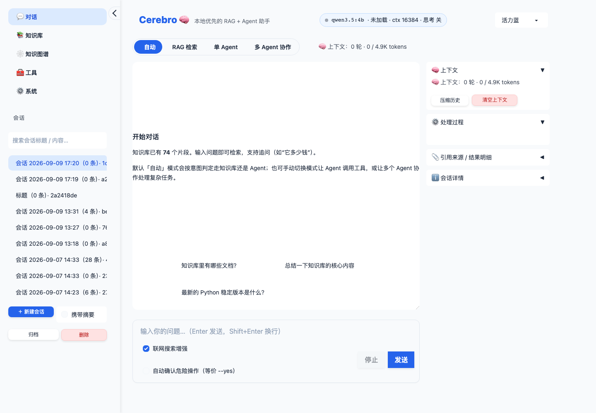 | 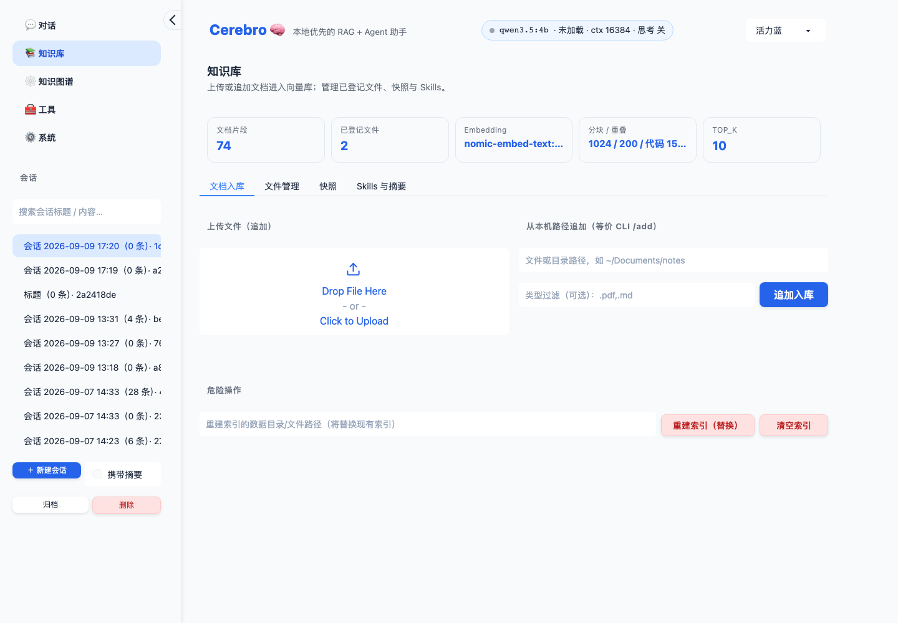 | 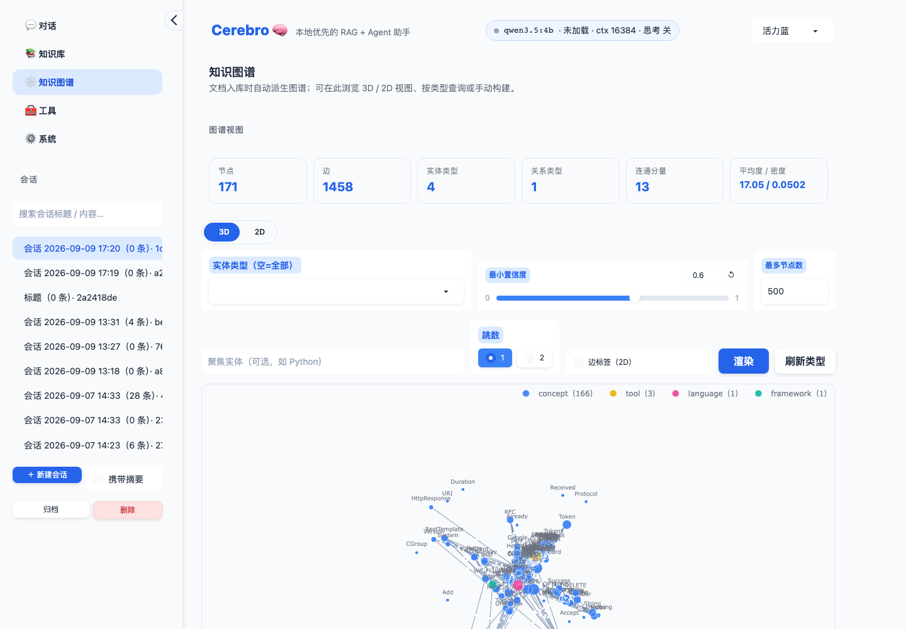 |

| 工具 | 系统 |
|---|---|
| 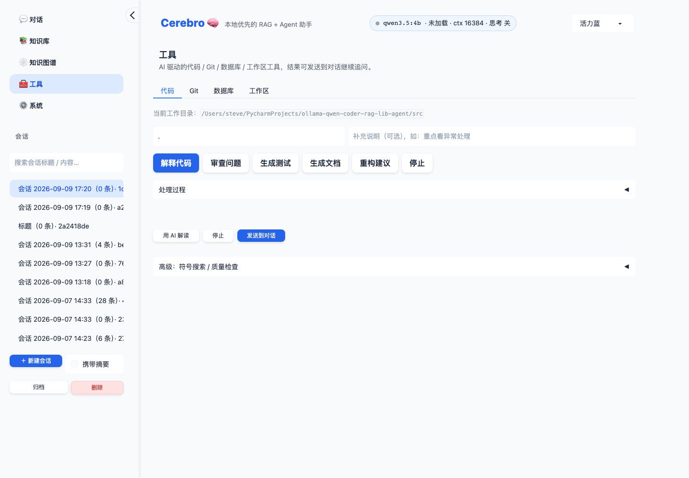 | 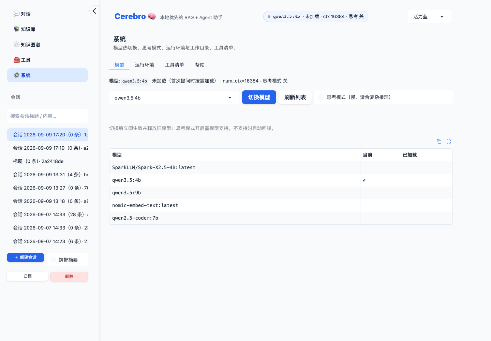 |

### P2-1（2026-09-09）

| 项 | 结果 |
|---|---|
| 全量测试 | `./venv/bin/python -m pytest -q -n 4` → **3528 passed, 36 skipped**，覆盖率 **92.05%**（门禁 80%）；`bm25_store.py` 98%、`task_scheduler.py` 100%、`agent_registry.py` 97%、`base_agent.py` 94% |
| 新增测试 | **+65 个**：`tests/test_bm25_store.py` 25（分词与 `RAGEngine._bm25_tokenize` 委托一致；upsert / 覆盖 / remove / `remove_where` / `remove_many` / `replace_all` / `clear` / dirty 与 `is_usable`；build 惰性与变更失效；`search` 返回 id / meta / 分数与标识符子词命中；**装配索引与 `BM25Okapi(token_lists)` 分数逐位一致（含覆盖 / 删除 / 落盘重读）**、装配失败回退、`sys.intern` 共享与 `_df` 增删；save → load 无需重建、文件格式、缺文件、tokenizer / schema 版本不匹配、6 种损坏文件 warning + 回退、save 失败清理临时文件、`delete_file` / `describe`）；`tests/test_rag_engine_bm25_store.py` 16（假 Chroma 集合 + `tmp_path` persist_dir：**增量 upsert 后检索 == 另一引擎全量重建**、追加第二批仍增量且 `get` 零调用、**remove_file 后 == 全量重建**、回退入库路径 stale → 仅重建一次、片段数不一致触发重建；**save → 新实例 load 无需重建**、tokenizer 版本改变触发重建并按当前版本重写、损坏文件 warning + 重建覆盖、**旧库无 `bm25/` 首查后生成 store 且用 Chroma id**、`clear_index` 删文件、store 写失败不影响入库；超限 `meta.hybrid_disabled_reason` / `hybrid_off` 事件 / `get_stats` / `hybrid_status`、可用与未请求时为 None、空库不上报但缺依赖上报、默认 50000 与 `Config` 映射；Web `format_stats` / `format_stats_cards` 提示与卡片数不变、CLI `print_knowledge_stats` 隐藏 None 与 `⚠️` 行）；`tests/multi_agent/test_concurrency_p2_1.py` 24（RLock 可重入；**16 线程并发注册 16 个 Agent 计数 / 三张索引完整且并发读不抛**、16 线程抢注同 id 只一个成功、16 线程注销 + clear、迭代快照；调度器 **16 线程 schedule → running → completed 统计 `{0,0,16,16}`**、贪心 / 失败 / sequential / competitive 路径；`FairSemaphore` FIFO 顺序 / 非阻塞 / 过度释放 / 等待中断出队；信号量读 config、`set_max_concurrency`、`slot_stats`、`describe_backend`；**limit=1 三请求峰值 1 且串行 ≥0.55s**、limit=2 峰值 2、0 不限制、异常释放槽位、OpenAI 与 Ollama client 共用信号量、`QueueWaitTracker` 实时 `total()` / 事件 / 回调异常吞掉；**信号量 1 时 3 个并行子 Agent（各超时 0.5s、每请求 0.3s）全部成功无 timeout、峰值 1、总耗时 ≥0.85s、排队事件首条非 transient、`queued_seconds` ≥2 个子任务 >0**；真正慢的请求仍超时且不记排队；单 Agent 被占槽 0.4s 后仍在 0.6s 超时内成功；同任务第二次排队为 transient；无 tracker 时退化为普通 join） |
| 现有测试断言 | 改了 **1 条参数**（`test_too_many_chunks_disables_hybrid_with_hint` 的 20001 / "20000" 改为跟随常量，见差异 #10），其余未动 |
| flake8 语法门禁 | `flake8 --select=E9,F63,F7,F82 src tests scripts` → rc=0 |
| 测试隔离 | 全量 `-n 4` 前后 `ls index_storage/` 均为 `chroma_db llama_index ocr_cache`，无 `bm25/`（首轮实现时曾泄漏一份伪造 store，已加 `isolate_bm25_store` fixture 并删除） |
| 手测：BM25 就位耗时（真实 Chroma 持久化集合 + 随机向量，1000 字 / 块，中位数 ×3） | 见下表 |
| 评测回归 | `scripts/eval_rag.py --hybrid on`（qwen3.5:4b，38 例，880s）→ `docs/development/rag-eval/reports/hybrid-on-p21-20260909.{md,json}`；与 P1-3 基线 `hybrid-on-20260909` 对比：**38 例检索结果（命中文件序列 / Recall@k / MRR）逐例完全一致**，通过 32/38 → 32/38（通过集合相同）、Recall@10 0.98 → 0.98、MRR 0.68 → 0.68、引用命中 0.62 → 0.65、关键词命中 0.78 → 0.80、负样本拒答 1.00 → 1.00、元查询 0.75 → 0.75、平均延迟 24.9s → 23.3s（引用 / 关键词 / 延迟的差异来自模型生成的随机性，检索层零变化）。**注**：脚本按 `{tag}-{日期}` 命名，同日重跑会覆盖基线文件，本次已把基线从 git 恢复、新结果另存 `hybrid-on-p21-*`，记为待办 |
| CLI `/stats` / `/config` | 终端输出见下 |
| Web 知识库页 | `format_stats_cards` / `format_stats` 实际渲染见下（无头环境，与 P0-1 同样以 formatter 真实输出替代截图） |

BM25 就位耗时与内存（脚本：临时目录建真实 Chroma 集合，`persist_dir` 隔离；"旧路径"= 此前 `_ensure_bm25` 的全量拉取 + 组装来源 + 分词 + `BM25Okapi`）：

| 场景 | 1000 块 | 10000 块 |
|---|---|---|
| 旧路径：入库后首次查询（每次入库都要付） | 139 ms（get 8 + tokenize 77 + okapi 42） | **1448 ms**（get 78 + tokenize 802 + okapi 456） |
| 新路径：入库后首次查询（仅 `build()`，不读 Chroma、不分词） | **2 ms** | **14 ms** |
| 新路径：增量入库 10 块的 BM25 维护成本（upsert + 落盘 gz） | 35 ms | 345 ms |
| 新路径：冷启动首次查询（load gz + build） | 68 ms | 697 ms |
| 新路径：旧库迁移首查（全量 + 落盘，仅一次） | 185 ms | 2067 ms |
| store 文件（gzip 级别 1） | 0.9 MB | 9.3 MB |
| 常驻内存：store（词频 + 来源元数据）+ `BM25Okapi` | 8.9 + 0.7 MB | 86 + 6.5 MB（旧实现 `BM25Okapi` + entries ≈ 72 MB） |

真实文档（本仓库 `docs/**/*.md` + `src/**/*.py` 切 1000 字，2499 块，词汇量 6.5 万）：常驻 36.6 MB → **每万块约 147 MB**；合成语料 93 MB / 万块。README / config / 关闭提示统一写"每万块约 100–150MB"。

CLI `/stats`（60000 块 > 上限 50000；`rich` 表格 + 表格下方黄色提示行）：

```
⚠️ 文档块数 60000 超过上限 50000，混合检索已关闭（仅向量检索）；可调大 RAG_HYBRID_MAX_CHUNKS（BM25 语料常驻内存，每万块约 100–150MB）
                                                📊 知识库统计
╭──────────────────────┬─────────────────────────────────────────────────────────────────────────────────────╮
│ 项目                 │ 值                                                                                  │
├──────────────────────┼─────────────────────────────────────────────────────────────────────────────────────┤
│ total_documents      │ 60000                                                                               │
│ …                    │ …                                                                                   │
│ top_k                │ 10                                                                                  │
│ self_check           │ False                                                                               │
│ hybrid               │ 已关闭：文档块数 60000 超过上限 50000，混合检索已关闭（仅向量检索）；可调大         │
│                      │ RAG_HYBRID_MAX_CHUNKS（BM25 语料常驻内存，每万块约 100–150MB）                      │
│ hybrid_max_chunks    │ 50000                                                                               │
╰──────────────────────┴─────────────────────────────────────────────────────────────────────────────────────╯
⚠️ 文档块数 60000 超过上限 50000，混合检索已关闭（仅向量检索）；可调大 RAG_HYBRID_MAX_CHUNKS（BM25 语料常驻内存，每万块约 100–150MB）
```

（可用时 `hybrid` 行为 `开（向量 + BM25 关键词，上限 50000 块）`，无提示行；第一行 `⚠️` 是查询时 `_ensure_bm25` 的既有 `print`。）`query_with_sources()["meta"]` = `{'hybrid_requested': True, 'hybrid_disabled_reason': '文档块数 60000 超过上限 50000，…'}`。`/config` 新增行：`LLM 并发上限: 2（多 Agent 并行时其余请求排队，可调 OLLAMA_MAX_CONCURRENCY）`。

Web 知识库页 `format_stats_cards(stats, file_count=12)`（60000 块）——五张卡片不变，下方追加提示条：

```html
<div class="cb-cards">…五张 cb-card…</div><div class="cb-empty cb-empty-sm">⚠️ 文档块数 60000 超过上限 50000，混合检索已关闭（仅向量检索）；可调大 RAG_HYBRID_MAX_CHUNKS（BM25 语料常驻内存，每万块约 100–150MB）</div>
```

`format_stats`（Markdown 版）末尾：`- 混合检索: 已关闭：文档块数 60000 超过上限 50000，…` + `> ⚠️ 文档块数 60000 超过上限 50000，…`；系统页运行环境新增 `LLM 并发上限（OLLAMA_MAX_CONCURRENCY） | 2（多 Agent 并行时其余请求本地排队，排队时间不计入子任务超时）`。

### P1-3（2026-09-09）

| 项 | 结果 |
|---|---|
| 全量测试 | `./venv/bin/python -m pytest -q -n 4` → **3463 passed, 36 skipped**，覆盖率 **92%**（门禁 80%）；`src/rag_eval.py` 100%、`scripts/eval_rag.py` 98%（未覆盖：`main` 与 `quiet_logging` 的导入失败分支） |
| 新增测试 | **+68 个**：`tests/test_rag_eval.py` 45（`norm_text` / `source_file` / 词表关系；`recall_at_k` 全命中 / 部分 / k 截断 / 重复来源 / 大小写与带目录 / 空来源 / 空期望 None / 非 dict 来源；`mrr` 各名次 / 无命中 / 重复不改首命中；`cited_refs` 去重、忽略代码块与 `[W1]` `[?]`；`resolve_citation` 按 ref / 按位置 / 越界 / ref 优先于位置；`citation_hit_rate` 全中 / 半中 / 越界 / 重复 / 无引用 / 无来源；`keyword_hit` 归一化 / `\|` 可选 / 空；`negative_rejected` 无来源 / 空答案 / 有来源需词表 / 英文；`evaluate_case` 检索类通过与不通过 / 无关键词 / 多跳部分命中 / `sources` 键回退 / meta / negative 有来源编造 / 出错最差值 / 截断 / 未知 type；`aggregate` 分组均值忽略 None / 空 / 错误计数 / 未知 type 排序；样本 fixture 分布下限与语料约束（≤20 文件、<200 KB、含 md/py/txt 与表格）、`load_cases` 过滤与裸列表、`validate_cases` 六类问题；`fmt_metric` / `fmt_delta`、`render_markdown` 无 previous 无 Δ / 有 previous 有 Δ 与「对比基线」行 / previous 直接传 aggregate / 上份缺某 type / 逐例表标记与错误明细）；`tests/test_eval_rag_script.py` 21（`--help` 含全部参数、choices 校验、`apply_env` 映射与 `none` 不写 env、`resolve_settings` 取 config 默认与 tag 默认；`isolate_runtime_state` 三处重定向与子模块故障容错、`disable_rerank` 恒等、`build_engine` 传 `persist_dir=<tmp>/index` + 关快照 / 安全 + `hybrid_enabled` + `file_paths` 去重排序 + 空语料抛错 + `count()` 失败为 -1、`quiet_logging`；`run_case` 成功（`answer_question` kwargs 精确断言）/ meta / negative / 检索出错不再问答、`run` 进度与 verbose 输出；`report_paths`、`find_previous_report` 排序与排除自身、`load_previous` 坏 JSON、`write_reports` 首份无 Δ → 第二份有 Δ → 同日重跑仍与更早对比 → 不同 tag 不对比、`summary_lines`）；`tests/test_rag_engine.py` +2（默认存储与 config 一致；`persist_dir` 重定向 Chroma / `llama_index` / 快照 / 统计且 `load_index` 空目录返回 None） |
| 现有测试断言 | **一条未改**；`scripts/eval_overcompliance.py` 词表改为导入后其 9 条单测原样通过 |
| flake8 语法门禁 | `flake8 --select=E9,F63,F7,F82 src tests scripts` → rc=0（语料 `.py` 也通过） |
| 样本验收 | 38 条：single 15 ≥12 ✓ / multi_hop 7 ≥6 ✓ / code_symbol 7 ≥5 ✓ / meta 4 ≥3 ✓ / negative 5 ≥4 ✓；语料 18 个文件 ≤20 ✓、36 KB <200 KB ✓、含 md / py / txt 与表格 md ✓ |
| 隔离验收 | 两次基线 + 一次 `--limit 2` 冒烟前后 `index_storage/chroma_db` 与 `.cerebro` 的 mtime 不变；临时目录运行后自动删除。顺带发现**既有**问题：全量测试会改写真实 `index_storage/chroma_db/chroma.sqlite3` 的 mtime，逐文件排查定位到 `tests/test_cli_handlers_rich_tables.py`（本任务新增的三个测试文件单独运行不触碰），记为待办 |
| 基线报告 | `docs/development/rag-eval/reports/hybrid-on-20260909.{md,json}`（38 例 949s）与 `hybrid-off-20260909.{md,json}`（751s），默认模型 `qwen3.5:4b` + `nomic-embed-text`，rerank `llm`，top_k 10。核心指标见下 |

两份基线的核心指标（合计行）：

| 指标 | hybrid-on | hybrid-off | 说明 |
|---|---|---|---|
| 通过 | **32/38** | 22/38 | |
| Recall@10 | **0.98** | 0.75 | BM25 补齐了 dense 漏掉的精确词命中（`retry_limit`、`E305`、`lease` 等）：single 1.00 vs 0.71，multi_hop 0.93 vs 0.57，code_symbol 两者 1.00 |
| MRR | **0.68** | 0.50 | |
| 引用命中 | **0.62** | 0.49 | |
| 关键词命中 | **0.78** | 0.56 | |
| 负样本拒答 | 1.00 | 1.00 | 5 例全部拒答（rerank 全部判无关 → `kb_only` 空答案，或答案含「资料未提及」） |
| 元查询识别 | 0.75 | 0.75 | `列出知识库中的文件` 未被 `is_meta_query` 识别（见风险） |
| 平均延迟 | 24.9s | **19.6s** | hybrid 多召回 → rerank 逐片段判定更多 → 慢约 5s/例；检索本身 <0.1s |

按类型（hybrid-on → off）：single 通过 11/15 → 4/15、multi_hop 7/7 → 4/7、code_symbol 6/7 → 6/7、meta 3/4 → 3/4、negative 5/5 → 5/5。

基线暴露的**既有管道问题**（本任务只记录不修，作为后续调参 / P2-1 的对照）：

| 用例 | 现象 | 指向 |
|---|---|---|
| `s11-metrics-port`、`s13-key-rotation`（hybrid-on） | Recall 1.0 但答案为空——`13-metrics.md` / `12-security.md` 已召回且排第 1，rerank（LLM）把全部片段判为无关 | rerank 过度过滤；`CONFIDENT_SCORE=0.6` 之下全部走 LLM 判定 |
| `s08-dead-letter-key` | 召回了明确写着 `lumen:dead` 的 `05-retry-policy.md`（第 2 名），rerank 只保留 `retry.py` 的类片段，答案称"资料未给出 `DEAD_LETTER_KEY` 的值" | 同上；另 `retry.py` 的模块常量与类被切成不同片段 |
| `s12-error-e305` | 答案称"E305 条目后直接结束"——`11-troubleshooting.txt` 在 E305 标题处被切块，正文落在下一块未被召回 | 文本分块边界（`CHUNK_SIZE=1024`）对"标题 + 正文"结构不友好 |
| `c05-dead-letter-methods` | 只看到 `__init__` / `push`，其余方法在另一片段 | 代码分块把类拆成多块后 rerank 只留一块 |
| `meta02-list-files` | 「列出知识库中的文件」走了检索，答案只列出 `01-intro.md` | `_META_QUERY_PATTERNS` 有 `列出文件` 但不匹配中间插词；正则的询问动词表无「列出」 |

### P1-2（2026-09-09）

| 项 | 结果 |
|---|---|
| 全量测试 | `./venv/bin/python -m pytest -q -n 4` → **3390 passed, 36 skipped**，覆盖率 **91.71%**（门禁 80%）；`llm_client.py` 自身 98% |
| 新增测试 | **+103 个**（新文件 `tests/test_llm_client.py`）：`OllamaClient` 普通 / 流式（token 拼接 == 返回、`on_response` 钩子、`should_stop`）/ 流中 error / 超时 / 连接错误 / 401 / 5xx（JSON 与纯文本 body）/ 流式 5xx 先于钩子抛出 / 非法 JSON / 非 dict / `list_models` `health` `unload`；`OpenAICompatClient` `/v1` 归一化 / 请求体与 `Authorization` / options 映射（`num_ctx` debug 一次）/ `think=False → reasoning_effort` / 400 重试一次并记住 / 其它 400 不误判 / `think=True` 不重试 / `LLM_REASONING_EFFORT` 可配 / SSE 流（垃圾行、空 choices、`[DONE]`、错误对象、裸 JSON 错误行、`should_stop` 吞读错误、非停止读错误抛出）/ 超时 / 401 提示 `LLM_API_KEY` / 404 / 429 / 5xx / 非法 JSON / 缺 choices / `list_models` `health`；工厂：默认 ollama、openai 选择与缓存、配置变化重建、`LLM_BASE_URL` 默认回落 `OLLAMA_BASE_URL`、未知 provider 回退 + warning 一次、config 不可导入的兜底、`client_for_host`（ollama 专用实例 / openai 忽略）、`ollama_client`、`connection_error_hint`、`describe_backend`；`available_models` 三种回退；五处调用点在 openai 模式的请求形态（react_engine 流式 / 连接错误文案 / `host` 专用 client / `stop()` 关闭 SSE 流、`complete_text`、`_default_complete`、托盘预热 `HTTP 503` / 非法 JSON、`check_service` / `check_status`）；`commit_generator` 两 provider × 成功 + 五种失败回退（参数化 12 例）；`model_switcher` / `bootstrap` / CLI（`config_rows`、横幅、`/model`、`/model list` 两种回退）/ Web（`env_info` + `format_env_info` 三态、`format_model_status` / `format_model_chip`、`models_notice` + `on_model_status`）的 provider 感知；`rag_engine._setup_llm` openai → `OpenAILike`（含 `reasoning_effort` 随 `set_think` 变化、`/v1` 后缀、无 key）；**grep 守卫** `TestNoDirectEndpointsOutsideLLMClient` |
| 现有测试断言 | 改了 **2 条**（详见差异表 #1）：`tests/test_desktop_app.py::test_warm_up_chat_model` 的 `/api/generate` → `/api/chat`（并加 `options == {"num_predict": 1}` 断言）、`tests/test_git_analyzer_commit.py::test_request_payload_and_parse` 的 `/api/generate` + `json["prompt"]` / `{"response"}` → `/api/chat` + `messages[0]` / `{"message": {"content"}}`。其余 3200+ 条一条未改 |
| grep 验收 | `grep -rn '"/api/chat"\|/api/generate' src/` → 仅 `src/llm_client.py:271`（docstring）、`:298`（`/api/chat`）、`:338`（`unload` 的 `/api/generate`）三处 |
| 依赖 | `llama-index-llms-openai-like==0.8.0`（无新增传递依赖：`llama-index-llms-openai 0.7.9` 已在 venv）；`bash scripts/verify_deps.sh` 全 ✓；`pip-audit -r requirements.txt` 带 CI 同一组 ignore → `No known vulnerabilities found, 5 ignored`（与 P0-2 相同的 5 条，**未新增**）；`packaging/cerebro.spec` `collect_all` 加 `llama_index.llms.openai_like` / `llama_index.llms.openai` |
| flake8 语法门禁 | `flake8 --select=E9,F63,F7,F82 src tests` → rc=0 |
| 手测后端 | 未装 LM Studio / vLLM，用 **Ollama 自带的 OpenAI 兼容端点** `LLM_PROVIDER=openai LLM_BASE_URL=http://localhost:11434` 作为"任意兼容服务"（走 `/v1/chat/completions` SSE + `/v1/models`，与 Ollama 原生协议无关）。`OpenAICompatClient` 直接调用：`health=True`、`/v1/models` 列出 5 个模型、流式 60 token 首字 **0.29s**、全文 2.14s、45 个增量 |
| 手测 CLI `/ask` | `python src/query_interface.py --no-history --query "知识库里主要有哪些主题？用三句话概括"`：横幅显示 `模型: qwen3.5:4b | 后端: openai @ http://localhost:11434`，`🤖 加载 LLM 模型: … (后端 openai @ http://localhost:11434/v1, context_window=16384, think=False)`，回答三段 + `[1]` 引用 + 来源表正常（终端输出见下） |
| 手测 CLI `/agent` | `--agent "读取 README.md 的前 5 行并原样列出"`：Step 1 `get_current_dir` → Step 2 `read_file` → Final Answer 渲染 README 首部，ReAct 协议经 OpenAI 兼容后端解析正常 |
| 手测 CLI `/config` `/model` `/model list` | 输出见下 |
| 手测 Web | `LLM_PROVIDER=openai … a.launch(server_port=7862)` + Playwright：对话页 RAG 检索流式（帧 1 @1.1s、帧 2 @26.4s、帧 3 @27.5s 气泡增长，状态行「✍️ 生成回答中… · 已用时 27 秒」），最终「✅ 完成 · 用时 32 秒 · 实际模式: RAG 检索 · 🔍 引用 3 处已核验」；系统页「模型」tab 状态行 `模型: qwen3.5:4b · 后端 openai @ http://localhost:11434 · num_ctx / 思考模式由后端决定`，「运行环境」tab 顶部 `LLM 后端 openai（OpenAI 兼容；num_ctx / 思考模式由后端决定）/ 后端地址 / 后端状态 ✅ 可达 / API Key 未设置（本地服务通常无需）/ Ollama 地址（嵌入模型）`。截图见下 |
| 全量并行偶发失败 | 首轮 `-n 4` 中 `tests/test_command_recommender/test_engine.py::test_format_recommendations` 失败一次、重跑通过。**已定位为既有缺陷并修复**（同分支后续提交）：`LearningEngine` 忽略注入配置、总是用 `get_config()` 全局单例，测试 `hide_recommendation("/ask")` 直接写用户真实的 `data/recommender_preferences.json`，另一 worker 的 `test_format_recommendations` 读到 `/ask` 已隐藏 → 输出为空。写入 `/ask` 隐藏记录后单跑可 100% 复现。修复后全量 `-n 4` 连跑 3 次 3395 passed，真实文件 mtime 不变。 |
| 首次手测暴露的缺陷 | 未加 `reasoning_effort` 时：`OpenAICompatClient.chat(..., num_predict=60)` 返回空串（60 token 全部是 `reasoning`）；CLI `/ask` 的 RAG 规划调用 `Request timed out.`（120s）后整条问答 >400s 未完成。加映射后全部恢复（见实现记录「思考模式映射」） |

Web 截图（`LLM_PROVIDER=openai`）：

| 系统 → 运行环境 | 系统 → 模型 |
|---|---|
| 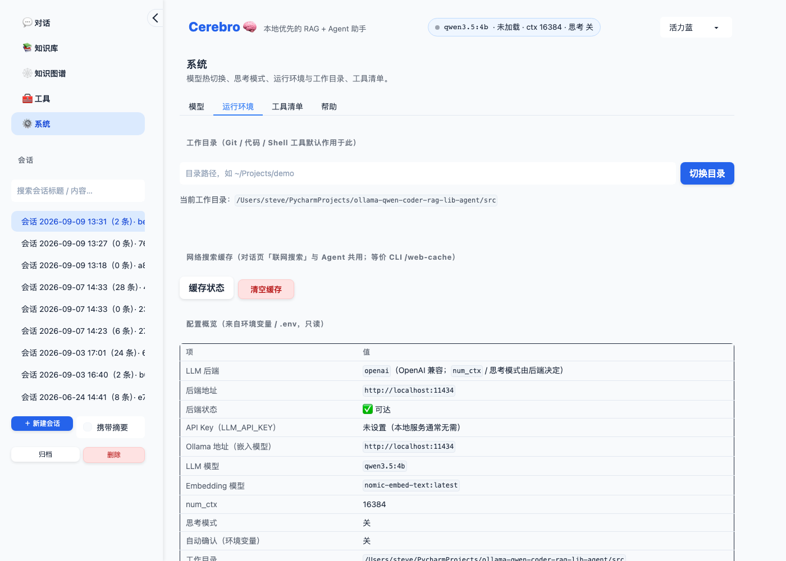 | 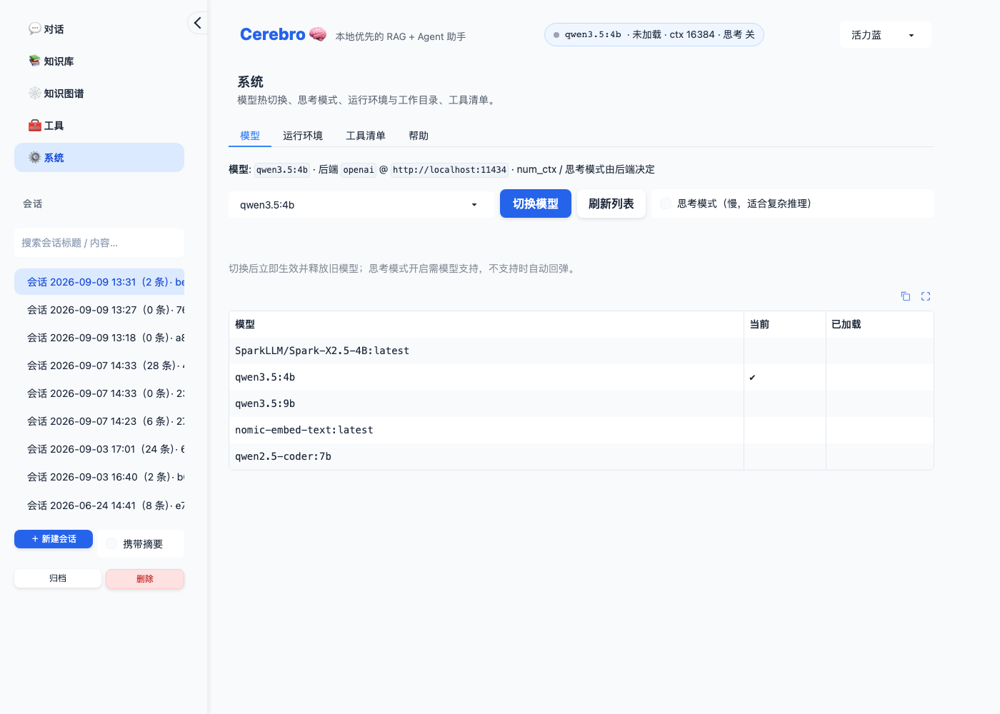 |

| 对话 · 流式中（27s，气泡增长） | 对话 · 完成（32s，引用 3 处已核验） |
|---|---|
| 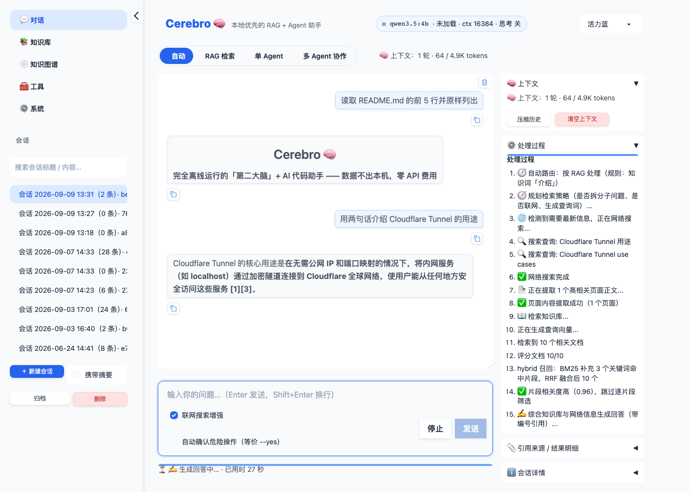 |  |

CLI `/ask`（`--query` 单次，`LLM_PROVIDER=openai`）：

```
│ 模型: qwen3.5:4b | 后端: openai @ http://localhost:11434                     │
╰──────────────────────────────────────────────────────────────────────────────╯
🤖 加载 LLM 模型: qwen3.5:4b (后端 openai @ http://localhost:11434/v1, context_window=16384, think=False)
🔢 加载 Embedding 模型: nomic-embed-text:latest
…
🔍 问题: 知识库里主要有哪些主题？用三句话概括
🤖 回答:
╭──────────────────────────────────────────────────────────────────────────────╮
│ 知识库里关于 Cloudflare Tunnel                                               │
│ 的主题主要集中在内网穿透的技术原理与实施步骤、前置准备所需的硬件与软件环境以 │
│ 及具体的操作指南（如 DNS 迁移与服务暴露）。                                  │
│  1 技术定位与优势：… [1]。                                                   │
│  2 前置环境要求：… [1]。                                                     │
│  3 操作时间与流程：… [1]。                                                   │
│ 主要依据来自知识库 [1]。                                                     │
╰──────────────────────────────────────────────────────────────────────────────╯
                      📚 参考来源（编号与回答中的  对应）
│ [1] │ cloudflare-tunnel-guide_v2.md │ 0.455 (关键词) │    4 │ 🚀 Cloudflare … │
```

CLI `/config` / `/model` / `/model list`（`LLM_PROVIDER=openai`，后端为 Ollama `/v1` 故列表可得）：

```
模型: qwen3.5:4b
LLM 后端: openai（OpenAI 兼容；num_ctx 由后端决定）
后端地址: http://localhost:11434
API Key: 未设置（本地服务通常无需）
Ollama 地址（嵌入模型）: http://localhost:11434
自动确认: 关
== /model
模型: qwen3.5:4b
后端: openai @ http://localhost:11434
num_ctx / 思考模式由后端决定；嵌入模型仍走 Ollama
自动确认: False
== /model list
本机已安装模型:
  - SparkLLM/Spark-X2.5-4B:latest
  - qwen3.5:4b  [当前/已加载]
  …
```

### P1-1（2026-09-09）

| 项 | 结果 |
|---|---|
| 全量测试 | `./venv/bin/python -m pytest -q -n 4` → **3287 passed, 36 skipped**，覆盖率 **91.42%**（门禁 80%） |
| 新增测试 | **+63 个**（新文件 `tests/test_streaming_p1_1.py`）：`_call_model` 流式 / 非流式请求体一致 / `LLM_STREAM=false` 单次回调 / 取消后不再回调且 `close()` 被调 / 跨线程 `stop()` 关闭响应 / 流中 error / 读错误 / 垃圾行；`FinalAnswerStream` 四例；`chat` 透传（仅 Final Answer、工具轮不产生 token、构造参数回退、无回调时 `_call_model` 无 kwargs、中断返回、强制总结）；`complete_text` / `consume_ndjson_stream` / `abort_response`；`rag_pipeline._complete` 经 `stream_chat` / 停止 / 思维链 / 无 `stream_chat` 回退 / `answer_question` 透传与单参兼容；`ResultIntegrator` / `MasterAgent` 注入复位 / `AgentOrchestrator` 透传；Web 服务层五种流的 `token` 事件（≥2 token → answer，取消后丢弃，无心跳）；Web 呈现层增量拼接 / 新轮清空 / 心跳不覆盖 / 取消保留部分回答；CLI `LiveAnswer` 四例 + `_run_ask` / `handle_agent` / `on_step_callback` / `handle_multi` 接线 + 帮助文案 |
| 现有测试断言 | **一条未改**。改动的只有测试替身的签名：`tests/conftest.py` 的综合桩 `_fake(prompt, on_token=None, should_stop=None)`（有回调时按 `LLM_STREAM=false` 语义一次性回调）、`tests/test_web_services.py` 的 `FakeReact.chat(user_input, on_token=None)`（2 处）与 3 个假编排器 `process_request(..., on_token=None)`、`tests/test_cli_handlers_multi.py` 的 `_Orch.process_request(..., on_token=None)` |
| flake8 语法门禁 | `flake8 --select=E9,F63,F7,F82 src tests` → rc=0 |
| 无 `on_token` 时请求体 | `test_no_on_token_request_unchanged`：`json["stream"] is False` 且 `requests.post` 不带 `stream=` 关键字；`test_no_on_token_calls_call_model_without_kwargs`：`chat()` 无回调时 `_call_model()` 零 kwargs |
| 首字延迟（`qwen3.5:4b`，同一 200 字提示，预热后） | **非流式：首字可见 6.57s（= 全文到达）** → **流式：首字 0.17s，全文 6.87s**（146 个增量）。命令：`complete_text(prompt)` vs `complete_text(prompt, on_token=…)` 计时 |
| 停止的实际效果（真实 Ollama） | 流式开始 6s 后 `engine.stop()`：`_call_model` **0.000s** 内返回（已收 148 个增量），紧接着的短请求 0.25s 返回（模型已停止生成，未排队）。流式尚未开始（仍在 `requests.post` 等响应头，即模型在处理 prompt）时 `stop()`：需等响应头到达（本机约 3.4s）才退出——此阶段没有可关闭的 response |
| 浏览器（`a.launch(server_port=7861)` + Playwright 无头 Chromium） | 三种模式各 3 帧 + 停止 2 帧见下 |
| CLI | `/ask` 与 `/agent` 在伪终端中的分帧输出见下 |

浏览器三种模式逐字出现（同一提问的连续 3 帧，气泡字数递增；截图裁到对话列）：

| 模式 | 帧 1 | 帧 2 | 帧 3 |
|---|---|---|---|
| RAG 检索（首 token 距发送 49.2s：前面是改写 / 规划 / 联网 / 检索 / rerank）|  7 字 |  28 字 |  41 字 |
| 单 Agent（首 token 63.8s：4B 模型先写 Thought，再流出 Final Answer）| 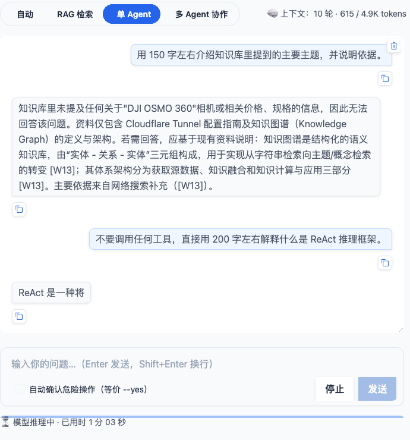 5 字 | 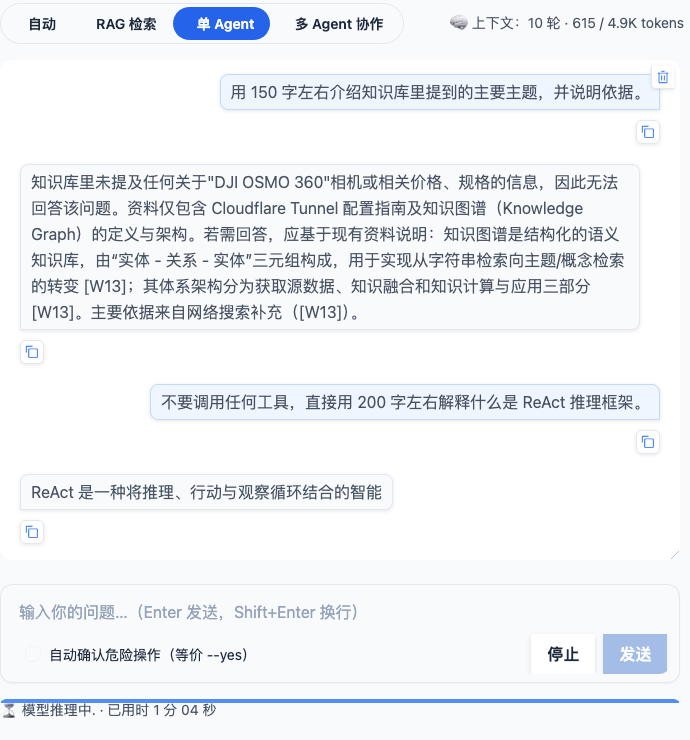 18 字 | 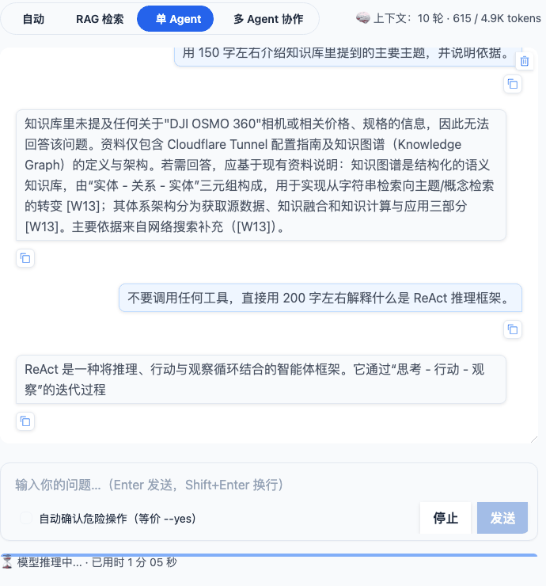 45 字 |
| 多 Agent 协作（整合阶段，两个子任务执行完 ~3.5 分钟后开始流出）| 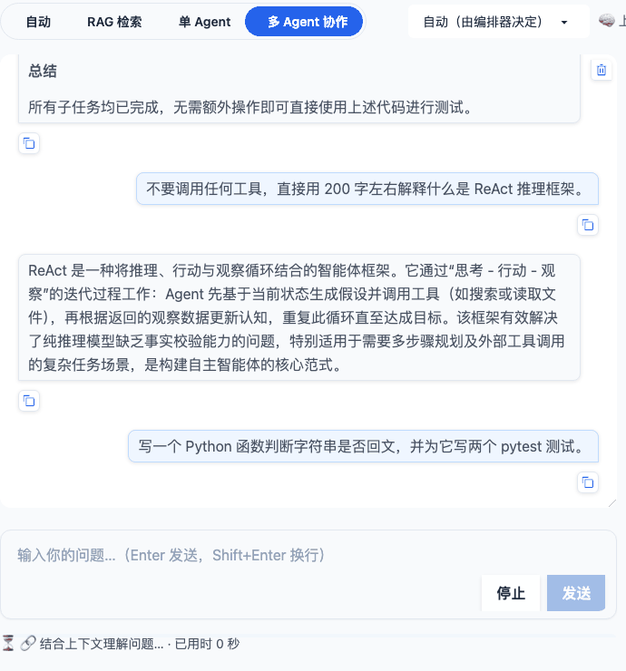 | 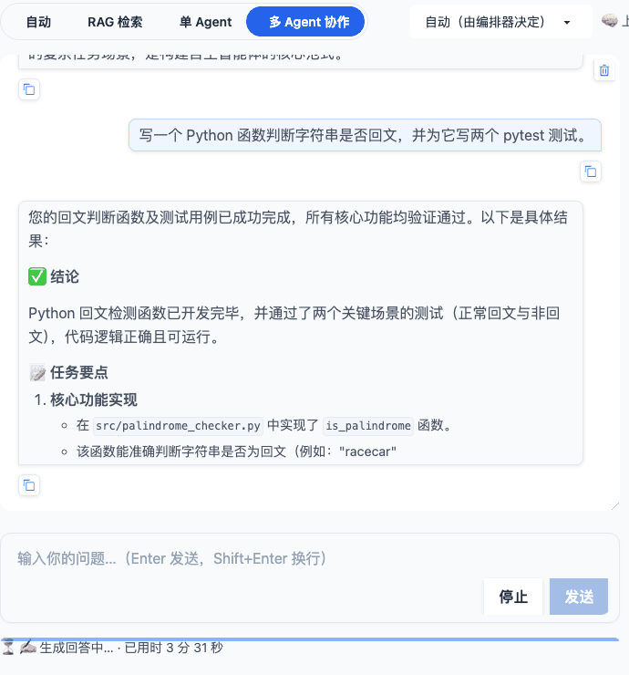 196 字 | 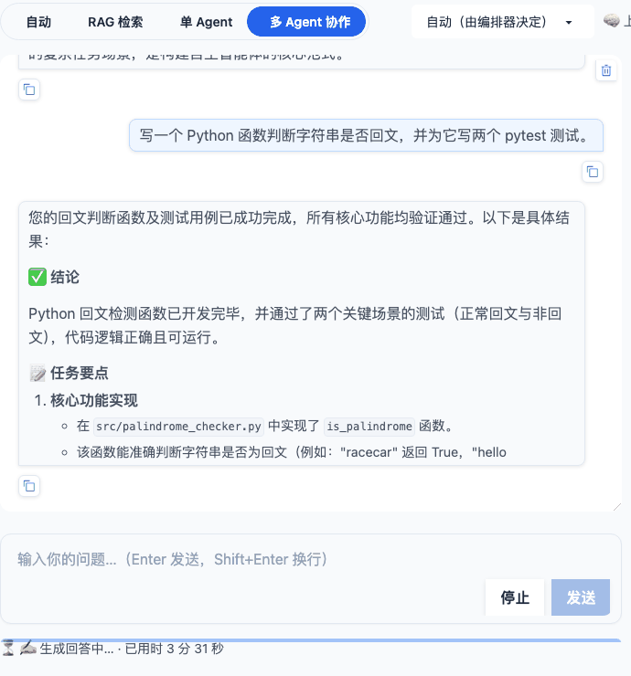 212 字 |

> 多 Agent 帧 1 抓到的是上一条历史消息（脚本按气泡计数切帧的误差），帧 2 / 3 为整合阶段真实增长。

停止：单 Agent 流出 33 字时点「停止」，**0.23s** 后状态行变为「⏹️ 已发送停止信号，正在中止…」、「发送」按钮恢复可用；气泡保留中断前文本。

| 停止前（流式中） | 停止后 |
|---|---|
| 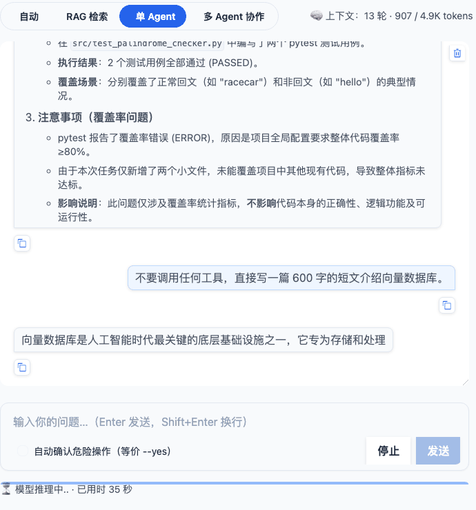 |  |

CLI `/ask`（伪终端 100×40，`script` 录制后按 rich Live 的光标上移序列切帧；共 46 次实时刷新，首帧距发命令 25.6s）：

```
--- 流式帧 1 @ 距发命令 25.60s ---
╭──────────────────────────────────────────────────────────────────────────────────────────────────╮
│ 知识库中未明确定义"主要                                                                          │
╰──────────────────────────────────────────────────────────────────────────────────────────────────╯
--- 流式帧 2 @ 28.57s ---
╭──────────────────────────────────────────────────────────────────────────────────────────────────╮
│ 知识库中未明确定义"主要主题"这一概念，仅提供了具体文档主题（如 HTTP/3 影响、Cloudflare           │
│ 内网穿透）及外部知识分类原则。根据资料                                                           │
│ [15][W5]，企业知识库通常按人力资源、市场营销、技术研发等大领域划分；而本地文档 [1][2][4]         │
│ 实际涉及的技术主题包括**HTTP/3 与                                                                │
--- 流式帧 3 @ 31.20s ---
│ 内网穿透（需迁移 DNS 记录并创建隧道）以及知识图谱的构建与应用（基于实体 -                        │
│ 关系三元组结构）。这些内容共同构成了当前资料库的核心技术主题。                                   │
│                                                                                                  │
│ 主要依据来自知识库                                                                               │
╰──────────────────────────────────────────────────────────────────────────────────────────────────╯
（随后照常打印 🤖 回答 面板、📚 基于知识库 N 个片段、🌐 网络来源表、/sources 提示）
```

CLI `/agent` + `Ctrl+C`（Live 面板刷新 1.5s 后发送 `\x03`）：

```
Ctrl+C 发送于 37.66s（首个流式刷新 36.12s）
已中断：用户中断，任务已停止，已关闭与模型的连接。        ← 与 Ctrl+C 同一采样帧内出现（<0.15s）
❯                                                          ← 回到提示符
```

### P0-2（2026-09-09）

| 项 | 结果 |
|---|---|
| 钉版本完整性 | `grep -cE '^[A-Za-z0-9_.-]+==' requirements.txt` → **28**；`grep -E '^[A-Za-z0-9_.-]+\s*$'` 无裸包名；非注释行全部含 `==` |
| `bash scripts/verify_deps.sh` | 运行时 23 项全 ✓（llama-index 插件包 / gitpython / opencv 按规则跳过），开发/测试 7 项全 ✓ |
| `pip-audit -r requirements.txt` | 升级三个包前 **51 条 / 5 包**；升级后 **5 条 / 2 包**（chromadb 4 条 + nltk 1 条），全部无修复版且已在 `ci.yml` ignore 列表中附理由。按 CI 原样带 ignore 参数运行 → `No known vulnerabilities found, 5 ignored`。**未新增任何 ignore** |
| `ci.yml` 语法 | `python -c "import yaml; yaml.safe_load(open('.github/workflows/ci.yml'))"` 通过；解析出 `on = {push: master, pull_request: master}`、`matrix.os = [ubuntu, macos, windows]` |
| 全量测试 | `./venv/bin/python -m pytest -q -n 4` → **3224 passed, 36 skipped**，覆盖率 **91.26%**（门禁 80%） |
| 归档 | `CHANGELOG.md` 出现 `## [v0.1.0] - 2026-09-09`，含 112 条一级要点；新 `[Unreleased]` 仅「发布流程」4 条 |

依赖版本差异（旧约束 → 新钉版本，仅列有变化的直接依赖）：

| 包 | 旧约束 | 新版本 | 备注 |
|---|---|---|---|
| setuptools | `>=60.0.0` | `==84.0.0` | 从 82.0.1 升级，修 PYSEC-2026-3447 |
| gitpython | `>=3.1.0` | `==3.1.62` | 从 3.1.50 升级，修 26 条 CVE/GHSA |
| pillow | 裸包名 | `==12.3.0` | 从 12.2.0 升级，修 19 条 PYSEC |
| pypdf | `>=6.15.0,<7` | `==6.18.0` | 本地实为 6.13.3（低于原约束），升级后钉版 |
| 其余 24 个直接依赖 | 裸包名 / 下限约束 | 冻结当前实测版本 | 见 `requirements.txt` |

> 未在干净 venv 里跑 `pip install -r requirements.txt -r requirements-dev.txt` 复装验证（约 2 GB 下载）；
> 已通过 `pip-audit -r requirements.txt` 的依赖解析间接确认全部钉版本可解，且 CI 三平台会在 PR 上做真实复装。

`git tag` 与推送命令（**待用户执行**）：

```bash
git tag -a v0.1.0 -m "v0.1.0: F8 Agent 模式优化 + F9 Web 工具页改版 + F10 P0 安全与依赖加固"
git push origin v0.1.0
```

### P0-1（2026-09-09）

| 项 | 结果 |
|---|---|
| 全量测试 | `./venv/bin/python -m pytest tests -q -n 4` → **3224 passed, 36 skipped**（第二次提交后） |
| 覆盖率 | **91.26%**（门禁 80%） |
| 新增测试 | **+100 个**（3159 → 3259 收集数；第二次提交 +20：`TestP01ReadBoundaryMoreTools`、`TestWorkspaceReadBoundary`、允许目录收敛 4 例、`test_high_risk_confirmed_once_executes_once`、Web handler 越界可见 2 例）。首次提交：`test_agent_tools_safety.py` +55（`TestP01TokenLevelGrading` / `TestP01AutoConfirmAllows` / `TestP01ReadBoundary` 三个新类）、`test_cli_handlers_database.py` +7（`TestP01AutoConfirmRiskGate`）、`test_cli_handlers_config.py` +6（新文件）、`test_query_interface_exec_safety.py` +6（新文件）、`test_react_engine.py` +2、`test_web_app.py` +2、`test_web_services.py` +1、`test_query_interface_parse.py` +1 |
| 无子串匹配 | `grep -n 'in command.lower()' src/agent_tools.py` → 无输出（并有 `test_no_substring_matching_left` 守卫） |
| CLI `/config` | 终端输出见下（第二次提交后允许读目录由 4 条收敛为 3 条：两个 gradio 哈希目录折叠为 `…/T/gradio`） |
| flake8 语法门禁 | `flake8 --select=E9,F63,F7,F82 src tests` → rc=0（此前配置错误无法运行） |
| Web 系统页 | 「运行环境」渲染见下 |

CLI（`READ_ALLOWED_DIRS=~/Documents`）：

```
模型: qwen3.5:4b
Ollama 地址: http://localhost:11434
自动确认: 关
自动路由: 开
工作目录: /Users/steve/PycharmProjects/ollama-qwen-coder-rag-lib-agent
允许读目录: /Users/steve/PycharmProjects/ollama-qwen-coder-rag-lib-agent : /Users/steve/Documents : /private/var/folders/.../T/gradio
允许写目录: /Users/steve/PycharmProjects/ollama-qwen-coder-rag-lib-agent
数据目录: /Users/steve/PycharmProjects/ollama-qwen-coder-rag-lib-agent/data
索引目录: /Users/steve/PycharmProjects/ollama-qwen-coder-rag-lib-agent/index_storage
Agent 最大步数 / 超时: 50 / 300s
提示: 路径边界越界时工具返回 [错误] 路径超出允许范围，可用 READ_ALLOWED_DIRS / WRITE_ALLOWED_DIRS 放行
```

Web「系统 → 运行环境」（`format_env_info(WebService().env_info())` 实际输出，`CODE_AGENT_AUTO_CONFIRM=true READ_ALLOWED_DIRS=~/Documents`）：

```
| 自动确认（环境变量） | 开（只放行 low / medium） |
| 工作目录 | `…/ollama-qwen-coder-rag-lib-agent/src` |
| 允许读目录 | `…/src` · `/Users/steve/Documents` · `/private/var/folders/…/gradio/bce86ed6…` · `/private/var/folders/…/gradio/bf6e094d…` |
| 允许写目录 | `…/ollama-qwen-coder-rag-lib-agent/src` |
```

> 浏览器截图未提交：本次在无头环境实现，用 service → formatter 的真实渲染输出替代（系统页即 `gr.Markdown(format_env_info(...))`，无额外交互逻辑）。

## 与需求的差异

### P2-2

| # | 需求 | 实际 | 原因 |
|---|---|---|---|
| 1 | services 拆为 `base / chat / knowledge / tools / graph / system` 六个文件 | 另拆出 **`db.py`**（`DatabaseMixin`，195 行） | 数据库段（SQLite 连接 / 查询 / 写 / NL→SQL）本就是原文件里独立的 `# --` 分段，塞进 `tools.py` 会让它到 860 行、超单文件 800 上限；`web/handlers/` 与 `cli/handlers/` 也都有独立的 db 处理器组，三层对齐。 |
| 2 | `query_interface.py` ≤800 行 | **1799 行**（2274 → 1799，只抽了需求点名的 `parser` 与 `help_text` 两段） | 剩余 1800 行里：解释器自保护 110、日志 / 控制台 90、回调（`on_step_callback` 等）170、渲染（`print_rag_sources` / `print_knowledge_stats` …）260、共享 RAG 编排适配 150、**引擎耦合命令 `handle_ask/_run_ask/handle_agent/handle_natural/handle_model/handle_exec…` 590**、`main` 230。这些都直接读写模块级 `rag_engine / react_engine / console / HAS_RICH`，而 `tests/test_cli_handlers_{context,model}.py`、`test_query_interface_{render,exec_safety}.py`、`test_streaming_p1_1.py` 等有 **170+ 处** `patch("query_interface.console")` / `patch.object(qi, "rag_engine", …)` 依赖它们留在 `query_interface` 命名空间。把它们搬走要么改这些测试的打桩目标（需求禁止改测试，只允许改导入路径——但这类是打桩目标不是导入），要么在新模块里做"全局状态代理"，两者都不再是"纯移动"。故本次只做无副作用的两段，剩余拆分已整理为 **[REQUIREMENTS.md §4 P3-2](REQUIREMENTS.md#p3-2-query_interfacepy-二次拆分p2-2-遗留纯重构--打桩迁移)**（代码事实见 §0.10：剩余分段行号与 223 处打桩分布；三步：`cli/state.py` 收口状态 → `render / callbacks / rag_adapter / recommend` 外迁 → `engine_commands` 外迁，允许改打桩目标模块）。 |
| 3 | `cli/help_text.py` 提供 `print_help` | `print_help(console=None, has_rich=False)` 带参；`/help` 文案作为**函数体内局部变量**保留而非模块常量 | 原函数零参、直接读模块全局 `console / HAS_RICH`；搬到无状态模块必须显式传入，`query_interface.print_help()` 保留零参签名做包装。文案不提成常量是因为 `tests/test_cli_handlers_multi.py` 与 `test_streaming_p1_1.py` 用 `inspect.getsource(print_help)` 断言文案含 `/multi <task>` / `流式`——提成常量会让这两条断言失效（需求禁止改断言），只把取源目标改为 `cli.help_text.print_help`。 |
| 4 | 「现有测试不改任何断言（只允许改导入路径…）」 | 断言未改；改了 13 处 `patch` / `monkeypatch.setattr` / `inspect.getsource` 的**目标模块** | 拆包后 handler 闭包从各自实现模块的全局取名（`web.handlers.graph.build_graph_figure`、`cli.handlers.git._git_overview` …），patch 旧模块 `web.app` / `cli_handlers` 上的同名引用不再影响实现。这是 Python 模块拆分的固有代价，已在 CODE_STANDARDS §1 与 MODULE_GUIDES 写明"patch 目标必须是实现模块"。 |
| 5 | `app.py` 重导出旧公开名 | 重导出 `formatters` 的**全部** 102 个顶层名（含 `_fmt_result` / `_noop` / `_starts_new_round` / `_hover_docs` / `_node_size` 等下划线名） | `tests/test_web_app.py` 直接 `from web.app import _starts_new_round, _noop`，`test_web_kb_management.py` 用 `web_app._hover_docs / _node_size / GRAPH_TYPE_COLORS`；只导公开名会漏掉这些。 |
| 6 | 「`pytest.ini` omit 改为 `src/web/ui/*`」 | 未改（已是 `*/src/web/ui/*`） | 路径未变化。 |
| 7 | 「`desktop_app.py` … Ollama 状态探测改用 `llm_client.health`」 | 未改 | P1-2 已把 `OllamaWarmer.check_service → health`、`StatusMonitor.check_status → list_models`，本次核对无剩余直连。 |
| 8 | 未提及 | `cli_handlers.py` shim 用 `from cli.handlers import *` + 显式列出 24 个下划线名 | `*` 不导出下划线名，而 `tests/test_cli_handlers_multi.py::test_default_factory_builds_orchestrator` 等直接用 `cli_handlers._default_orchestrator`、`_MULTI_MODES`。 |

### P2-1

| # | 需求 | 实际 | 原因 |
|---|---|---|---|
| 1 | store 文件 `docs: {doc_id: {tokens, metadata}}` | `docs: {doc_id: {tf, len, metadata}}`（词频字典 + 词数），内存同样只存词频，`build()` 直接装配 `BM25Okapi` 而不重建 | 首版按需求存 token 列表实测：1000 块常驻 **37MB**（中文单字 + 二字组的 token 列表全是独立 str 对象），换算 1 万块 370MB、默认上限 5 万块 1.8GB，不可接受。改为词频字典 + `sys.intern` 后 1 万块 93MB（合成语料）/ 147MB（真实文档，词汇量 6.5 万），其中 `rank_bm25` 自身索引就占 72MB——旧实现也有这部分。分数与标准构造逐位一致（`test_scores_identical_to_standard_bm25okapi`）。 |
| 2 | 「`threading.Semaphore(OLLAMA_MAX_CONCURRENCY)`」 | 自实现 FIFO 的 `FairSemaphore` | `threading.Semaphore` 不公平：刚释放的线程立刻再请求常抢在早已排队的线程之前。多轮 ReAct 的子 Agent 每轮都发请求，会把另一个子 Agent 饿死——而 P2-1-d 又规定排队时间不计入超时，饿死就等于**永不超时**（写测试时用一个死循环请求的"霸占者"线程复现：被排队的任务卡住不返回）。FIFO 后霸占者只能排到队尾，被测任务最多等一轮。 |
| 3 | 「`_ensure_bm25`：store 存在且版本匹配 → 直接 `build()`」 | 另加 `len(store) == collection.count()` 一致性检查，不一致则全量重建 | `count()` 本来就要查（上限判断），比较是零成本；它兜住了外部工具直接写 Chroma、上一进程 `save()` 失败、以及 `index.insert(doc)` 回退路径等所有"增量拿不到 id"的情形，避免 store 与向量库悄悄漂移。 |
| 4 | 「默认上限提升到 50000，README 注明内存估算（约 每万块 30–50MB）」 | 默认 50000 照做；估算按实测写 **每万块约 100–150MB**（合成 1000 字块 93MB、仓库真实文档 147MB），README / config 注释 / 关闭提示三处一致，并建议 8GB 机器设 20000 | 30–50MB 是立项估算，与实测差 3 倍；写小了会让用户在 8GB 机器上把上限调到 5 万后 OOM。 |
| 5 | 「CLI `/status`」 | 落在既有 **`/stats`**（知识库统计），`hybrid_disabled_reason` 在表格下方黄色 `⚠️` 单独一行；另 `/config` 加「LLM 并发上限」 | CLI 没有 `/status` 命令（与 P1-2 差异 #3 同一处笔误），`/stats` 正是"知识库统计"的入口，且 `print_knowledge_stats` 逐键打印 `get_stats()`，新键自动出现。 |
| 6 | 「Web 知识库页统计区显示…」 | 卡片下方追加一条 `cb-empty` 提示，不加新卡片；同时 Markdown 版 `format_stats` 加"混合检索"一行 | 现有测试断言卡片数恰为 4 / 5；提示只在关闭时出现，正常状态不占位（"失败可见、成功安静"）。 |
| 7 | 「`master_agent` 子任务超时计时在获得信号量后开始」 | 实现在 `BaseAgent.execute_task_with_timeout`（`master_agent` 一行未改） | 超时本来就只在 `execute_task_with_timeout` 的 `join` 里实现（§0.6 未记录这一事实），`master_agent` 只是调用它；且子任务一次 ReAct 会发多次请求、每次都可能排队，只有在任务粒度累计等待时间才正确。 |
| 8 | 未提及 | gzip 压缩级别 1；`save()` 每次入库 / 删除后立即落盘 | 级别 9 在 1 万块上 2.8s（每次入库都要付），级别 1 只 0.19s、体积 7.4MB → 11.4MB；立即落盘换来"进程被杀也不丢增量"，代价已可接受。 |
| 9 | 未提及 | `tests/conftest.py` 新增 autouse `isolate_bm25_store`（重定向 `rag_engine.INDEX_DIR`） | 实现后首轮全量测试把 Mock Chroma 的伪造片段写进了真实 `index_storage/bm25/store.json.gz`（已删除）；AGENTS.md 要求测试不得触碰 `index_storage/`。 |
| 10 | 「现有测试全部不改断言」 | 改了 `tests/test_rag_engine.py` 的 1 条参数 + 1 条注释：`test_too_many_chunks_disables_hybrid_with_hint` 的 `count=20001` / `"20000" in message` 改为跟随 `RAG_HYBRID_MAX_CHUNKS` 常量（并追加 `meta` 断言）；`test_bm25_index_lazy_and_invalidated` 只改注释说明 MagicMock 文档走的是回退 → stale → 全量路径 | 前者写死的 20000 与"默认上限提到 50000"互斥；其余 3400+ 条断言未动。 |

已知限制：LlamaIndex 的 `Settings.llm`（RAG 综合 / 规划 / 自校验）与 `OllamaEmbedding` 请求**不经 `llm_client`，不受并发限流**——多 Agent 中 RAG Agent 的检索问答与其它子 Agent 的 ReAct 请求仍可能同时打到 Ollama；`OLLAMA_MAX_CONCURRENCY` 目前约束的是 ReAct / `complete_text`（rerank、路由、分解、整合、摘要、提交信息）这条主路径。BM25 store 与 Chroma 之间没有事务：入库写 Chroma 成功、store 落盘失败时靠下次 `count()` 不一致兜底重建。

### P1-3

| # | 需求 | 实际 | 原因 |
|---|---|---|---|
| 1 | 「`RAGEngine(persist_dir=tmp)`」 | `RAGEngine.__init__` 此前**没有** `persist_dir` 参数（存储路径来自模块常量 `INDEX_DIR` / `VECTOR_DB_PATH`），本次新增 | 立项 §0.5 未记录这一事实。加参数只改存储位置（`index_dir` / `vector_db_path` 属性），不传时读模块常量，检索 / rerank / 编排逻辑与现有测试零改动；比在脚本里 patch 模块常量更安全（快照管理器等同样跟随）。 |
| 2 | 「`negative_rejected` 复用 F9-1 的 `HOLD_WORDS`」 | 用 `REJECT_WORDS = HEDGE_WORDS ∪ HOLD_WORDS`（去重保序），三份词表都迁到 `src/rag_eval.py`，`eval_overcompliance.py` 改为导入 | `HOLD_WORDS` 是"被质疑仍坚持"的核对口径（含「前提」「实际上」），单独用来判拒答会漏掉「未找到」「无法回答」「没有相关」这些 `HEDGE_WORDS` 里的典型拒答词。词表放 `src/` 是因为 `src` 不应反向 import `scripts/`。 |
| 3 | 「`--tag NAME`」（必填语义） | 可选，默认 `hybrid-<on\|off>` | 两份基线正好对应两个默认 tag，少一个必填参数；显式 `--tag` 仍用于试验配置。 |
| 4 | 「对每条用例调用 `query_with_sources` 与 `answer_question`」 | 同需求，且 `answer_question(..., enable_web_search=False, kb_only=True)` | 评测不联网、不做模型兜底：negative 在知识库无命中时得到空答案（计为拒答），而不是走网络 / 自身知识作答把"拒答率"变成"联网质量"。meta 类同样跑一次检索（<0.1s），使逐例表能看到"若不识别会召回什么"。 |
| 5 | 「`aggregate(results)`：按 type 分组均值 + 总均值 + 平均延迟」 | 另加每组 `n` / `passed` 与顶层 `errors`；逐例行有 `passed` 判定（检索类 Recall>0 且关键词 ≥0.5；meta 识别；negative 拒答） | 汇总表需要"通过 x/y"一列才能一眼看出退步在哪一类；判定阈值写在报告「指标说明」里，可按需调整。 |
| 6 | 未提及 | `--corpus` / `--out-dir` / `--model` / `--debug` 参数；`validate_cases` 在运行前校验样本（id 唯一、type 合法、`expected_files` 存在于语料、meta / negative 无期望文件） | 换语料 / 换输出目录 / 换模型对比是脚本的主要用法；样本写错（文件名打错）会让 Recall 永远为 0 而不报错，先校验再跑。 |
| 7 | 未提及 | 逐例 JSON 另记 `retrieval_seconds` / `answer_seconds` / `hybrid_applied` / `answer_kind` / `answer`（前 600 字） | 平均延迟几乎全是模型生成时间；分开记才能判断变慢是检索还是 rerank / 规划调用数增加。答案摘录用于事后核对"为什么没通过"。 |
| 8 | 「样本 `expected_files`」 | 采用标准 Recall（命中数 / 期望数），期望文件列出**所有**直接含答案的文件；不做"任一命中即可"的特殊匹配 | 冒烟时发现 `s01` 的 `3.11` 同时出现在安装文档与 2.0.0 发布说明，模型引用了后者；与其加 `match_any` 开关让指标定义分叉，不如把样本标注补全。已在 TEST_DESIGN §7.2 写明标注规则。 |

### P1-2

| # | 需求 | 实际 | 原因 |
|---|---|---|---|
| 1 | 「现有测试全部不改断言」 | 改了 2 条断言 | 两条恰好把被替换的端点写进了断言：`test_warm_up_chat_model` 断言预热 URL 含 `/api/generate`，`test_request_payload_and_parse` 断言提交信息请求 URL 为 `/api/generate`、载荷键为 `prompt`、响应键为 `response`。需求 P1-2-b 明确要求这两处改为 chat 消息格式，二者互斥；改为断言 `/api/chat` + `messages[0]`，其余部分（`think=False`、`stream=False`、`options`、`timeout=60`、解析结果）原样保留。 |
| 2 | 「`think` 忽略」 | `think=False` → 发送标准字段 `reasoning_effort=LLM_REASONING_EFFORT`（默认 `none`）；后端 400 时自动去掉重试并记住；`think=True` 不发送 | 手测证明"忽略"不可用：qwen3.5 在 Ollama `/v1` 上默认思考，`max_tokens=60` 的调用返回空 `content`，RAG 规划 120s 超时，整个产品在 openai 模式下不可用。`reasoning_effort` 是 OpenAI 官方字段（Ollama 兼容层与 OpenAI 均识别），不识别的后端经一次 400 自动降级到"忽略"，即需求原语义。 |
| 3 | 「CLI `/models`、`/status`」 | CLI 没有这两个命令，落在既有的 **`/model list`**（列表 + 回退提示）、**`/model`**（后端 / 地址 / 由后端决定的提示）、**`/config`**（`LLM 后端 / 后端地址 / API Key / Ollama 地址（嵌入模型）`）与**启动横幅** | 立项 §0.4 写的是「模型列表 / 健康：`model_switcher`、`bootstrap`、`desktop_app` 状态轮询」，命令名系笔误；未新建命令以免与 `/stats`（知识库统计）混淆。 |
| 4 | §0.4 列「五处直连」 | 另改了 **`model_switcher.unload_model`**（`/api/generate` + `keep_alive: 0`） | 它同样直连 `/api/generate`，不改则 grep 验收不过；作为 Ollama 专有能力放进 `OllamaClient.unload`，openai 模式下 `switch_model` 不再调用。 |
| 5 | 「`bootstrap` 的 Ollama 安装 / 拉模型引导仅在 `LLM_PROVIDER=ollama` 时触发」 | openai 模式改走 `_ensure_openai_backend_ready`：探测后端 health（不可达 → 通知 + 返回 False），并**提示**嵌入模型是否就绪（Ollama 未运行 / 缺 `EMBED_MODEL`），不安装、不拉取 | 只"不触发"会让 openai 用户在后端没起、或知识库因缺嵌入模型静默失效时毫无提示（违反 §5「失败可见」）。 |
| 6 | 「`openai` 模式 `list_models` 失败时回退 `[LLM_MODEL]` 并提示」 | 同需求；另让 `switch_model` 在此情形下**放行任意模型名**并在结果中注明「未校验模型是否存在」 | 回退列表只有当前模型时，沿用"必须已安装"的校验会让 `/model <name>` 永远失败，用户无法切到后端里的其它模型。 |
| 7 | 未提及 | `ReActEngine(host=…)` 语义：ollama 模式且 `host` 与全局地址不同 → 该地址的专用 `OllamaClient`；openai 模式忽略 `host` | `agent_config.py` 给子 Agent 硬编码 `host="http://localhost:11434"`，若一律用全局 client 会改变现有行为；若一律按 `host` 建 client，openai 模式下子 Agent 会打到 Ollama。`client_for_host` 兼顾两者，`engine.host` 属性与测试断言不变。 |
| 8 | 未提及 | 新环境变量 `LLM_REASONING_EFFORT`（需求为三项，实际四项） | 见 #2；给出关闭 / 调级的口子，避免把行为写死。README 环境变量表、`Config`、Web 系统页（隐含在 `LLM 后端` 行说明中）同步。 |
| 9 | 未提及 | `desktop_app.StatusMonitor.check_status` 的状态键仍叫 `ollama_service`，另加 `provider` | `status.log` 历史记录与托盘「系统状态」弹窗读该键；改名要迁移旧日志，收益为零。 |
| 10 | 「Web 系统页 … 经 `health`」 | `env_info()` 内做一次 `health()` 探测（超时 2s）并渲染「后端状态 ✅ / ❌ / —」 | 系统页本就在进入时刷新一次 `env_info`，探测成本可接受；`format_env_info` 对 `backend_healthy=None`（异常）显示「—」不阻断页面。 |

已知限制（openai 模式）：**嵌入仍需 Ollama**（`EMBED_MODEL` 走 `OLLAMA_BASE_URL`，只用 Agent 对话可不开 Ollama）；**`num_ctx` 由后端决定**（`LLM_NUM_CTX` 仅用于历史 / 片段 token 预算，需手动与 vLLM `--max-model-len` 等对齐）；模型驻留 / 释放 / `/api/ps` 为 Ollama 专有，openai 模式不显示；`OpenAILike` 路径没有 `reasoning_effort` 的 400 自动降级（后端不识别时需设 `LLM_REASONING_EFFORT=` 空）；LM Studio / vLLM 本机未安装，仅以 Ollama `/v1` 兼容端点完成手测。

### P1-1

| # | 需求 | 实际 | 原因 |
|---|---|---|---|
| 1 | 「`ReActEngine.chat` 增加 `on_token` 参数并逐轮透传」 | 逐轮透传，但经 `FinalAnswerStream` 过滤，**只转发 `Final Answer:` 之后的文本**；工具调用轮不产生 token | 原始增量是 `Thought: … Action: read_file … Action Input: {...}`，直接推给 UI 会让用户先看到一段协议文本再被整段替换。过滤后 `_parse_response` 仍拿到完整累积文本，协议不受影响。代价：`Final Answer:` 出现前（模型写 Thought 期间）没有 token，单 Agent 首字比 RAG 综合晚。 |
| 2 | 「心跳仅在 ≥2s 无任何事件时发送」 | 保持 `heartbeat_interval = 1.0s`，语义为「≥1s 无任何事件（含 token）」 | `_bridge` 的 `queue.get(timeout=heartbeat_interval)` 本来就只在队列空闲时发心跳，流式期间自然静默；状态行「已用时」刷新依赖 1s 心跳，改成 2s 会让计时明显跳格。若仍要 2s 可改一处常量。 |
| 3 | 「取消：`stop_current` 触发时关闭底层 `response`」 | 单 Agent：`engine.stop()` → `abort_response`（**socket shutdown + close**）；RAG 综合与多 Agent 整合：靠 `should_stop` / 取消标志在**每个 token 之间**退出并 `gen.close()` / `resp.close()` | RAG 走 LlamaIndex `stream_chat`（ollama python client → httpx），没有可跨线程关闭的 `requests.Response`；生成期间 token 间隔约 50ms，实测停止延迟与关闭连接无差别。只 `close()` 不够：macOS 上另一线程 `close()` 不会唤醒阻塞的 `recv`，故加 `shutdown`。 |
| 4 | 「CLI … `rich.live.Live(Markdown(buffer))` 增量渲染」 | `Live(Panel(Markdown(buffer)), transient=True)`，完成后**清除实时区域再按原格式打印全文** | 答案面板前后还有「🤖 回答」头、`🔗 已理解为`、notices（before / after）、来源表、引用校验计数；若让 Live 面板直接作为最终输出，这些只能排在面板之后，破坏既有版式与所有现有 CLI 输出断言。transient 方案最终输出与非流式**逐字一致**，只多一次极短的面板替换。 |
| 5 | 「`Ctrl+C` 中断时关闭连接并打印"已中断"」 | 文案为「已中断：用户中断，任务已停止，已关闭与模型的连接。」（`/agent`）与「已中断，已关闭与模型的连接。」（`/ask`）；`/multi` 为「已中断：用户中断，协作已停止。」 | 保留原有「用户中断」字样（`test_cli_handlers_multi` 断言 `"用户中断" in ...`），并加"已中断"前缀满足验收。此前 `/ask` 期间 `Ctrl+C` 会直接抛出到主循环退出程序，现在回到提示符。 |
| 6 | 「`llm_helper.complete_text` 增加可选 `on_token`」 | 另加 `should_stop`，并抽出 `consume_ndjson_stream` / `abort_response` 供 `react_engine` 复用 | 避免 NDJSON 解析在两处各写一份；`abort_response` 需要被 `ReActEngine.stop()` 调用。 |
| 7 | 「现有测试不改断言」 | 断言未改；改了 6 处**测试替身签名**（见验证表） | 服务层 / CLI 现在总是传 `on_token`，固定签名的假引擎 / 假编排器 / 综合桩会 `TypeError`。加 `on_token=None` 形参不影响任何断言。 |
| 8 | 未提及 | `handle_agent` 用 `engine.on_token = live.on_token` 注入而非 `engine.chat(task, on_token=)` | 现有 3 条断言 `engine.chat.assert_called_once_with(text)`；引擎级回调本就是 `__init__(on_token=)` 支持的路径，`chat` 结束后恢复原值。 |
| 9 | 未提及 | Web 生成期间 transient 推理心跳不再覆盖「✍️ 生成回答中…」；`cancelled` 时保留部分回答并注明 | 首轮浏览器验证发现状态行在流式期间被「模型推理中.」反复覆盖；停止后气泡清空会让用户丢失已看到的内容。 |
| 10 | 需求「浏览器验证 … 点击停止后 1s 内状态变为已取消」 | 0.23s 内状态行变为「⏹️ 已发送停止信号，正在中止…」并解锁「发送」；最终「⏹️ 已停止 · 用时」帧未稳定出现 | Gradio 的 `cancels=` 会在停止时直接终止流式事件（`GeneratorExit`），`cancelled` 帧是否来得及渲染取决于时序，属既有行为（F7 起如此），本次未改。 |

### P0-1

| # | 需求 | 实际 | 原因 |
|---|---|---|---|
| 1 | 「原有测试全部不改断言」 | 改了 4 条 | 这 4 条恰好编码了被移除的子串行为，与 P0-1-a 互斥：`write_file test.py content` / `insert into table` / `update table set` 由 medium 改为 **low**（首 token 不是修改类命令，也无 SQL 客户端上下文），`python rm_all.py` 由 high 改为 **medium**（正是 §1 点名的误报）。改动处均写明原因，其余断言一字未动；另给 `TestReadFile` / `TestListDirectory` / `TestSearchFiles`、`TestAnalyzeProjectStructure`、Web 的 `TestCodeAssist` / `TestCodeSymbolsAndQuality` / `TestWorkspaceBrowse` 加了设置 `READ_ALLOWED_DIRS` 的 autouse fixture（**只加 fixture，不改断言**，沿用 P1-7 给 `TestWriteFile` 加 `WRITE_ALLOWED_DIRS` 的先例）；第二次提交把 3 处用绝对越界路径测"不存在"的**参数**改到允许目录内（`/nonexistent/path` → `temp_dir/nonexistent`、`/nope/x.txt` → `tmp_path/nope.txt`），断言文本不变，并给 `list_dir("/")` 用例追加了一条越界 error 断言。 |
| 2 | medium 集含 `tee`、`dd`、`sed -i` | 同需求；SQL medium 集扩到 `alter` / `replace` | 与 `insert/update/delete` 同类的写操作，漏掉会留缺口。 |
| 3 | 透明前缀「`sudo` / `env VAR=`」 | 扩到 `doas xargs nohup time command builtin exec nice ionice` 及其带值选项 | §1 验收要求 `ls | xargs rm` → high，仅剥 sudo/env 做不到；带值选项（`sudo -u root rm x`）不剥会把选项值当命令名。 |
| 4 | SQL 关键字「首 token 为客户端或命令含 `-c`/`-e`」 | 另对 `-c`/`-e` 的载荷递归做首 token 判定（深度 ≤2） | 否则 `bash -c 'rm -rf build'` 判 low。 |
| 5 | 只读判定 | 由「任一 `READONLY_PATTERNS` 命中」改为「全部子命令命中」 | `ls | xargs rm` 会被 `^ls` 提前判 low，无法满足验收要求的 high。需求未提及此处，但不改无法达成验收。 |
| 6 | 「CLI `/config` 增加两行」 | **新建** `/config` 命令 | 该命令原本不存在（§0.2 的 `query_interface.py:1517` 实际指向 `/model` 无参输出的「自动确认」行）。经确认新建 `/config`，一并显示模型 / 自动确认 / 数据与索引目录等运行配置，与 Web「运行环境」对齐；`print_help`、`TUTORIAL_TEXT`、README 命令表同步。 |
| 7 | 未提及 | `react_engine` 的 `registry.execute` 增加 `or step_record["confirmed"] is True` | 闸门收紧后，high 命令经用户确认仍会被 registry 二次索要确认（`[CONFIRM_REQUIRED]`）。加此条保持「确认一次即执行」，不引入新的免确认路径。 |
| 8 | 未提及 | CLI `/file <path>` 一并受读边界约束 | 经确认：用户显式命令与 Agent 同一边界，无绕过口；README 与 `print_help` 说明可用 `READ_ALLOWED_DIRS` 放行。 |
| 9 | §1 只点名 `read_file` / `list_directory` / `search_files` | **扩到** `analyze_project_structure` / `ast_search` / `code_quality_check` / `git_analyze` / `git_commit_gen` 与 Web「工具」页 7 个直接读盘入口（第二次提交） | 首次提交后核实：Web 端 `services.py` 有 5 处直接 `open()` / `os.walk()` 完全绕过边界——Agent 读 `~/.ssh` 被拦，Web 工作区输入同一路径却能预览，违反 AGENTS.md "禁止只修一端"。`database_connect` 的 SQLite 路径仍未接边界（数据库工具另有 `safe` 标记），记为待办。 |
| 10 | 需求"已入库文件所在目录" | 落在 Gradio 上传根下的目录折叠为根一条；被包含的子目录不列 | 每个 Web 上传文件都在独立哈希目录，逐条列出会让 `/config` / 系统页随入库数增长；上传根下都是用户自己上传的内容，放行整个根不扩大风险面。 |
| 11 | 本次未要求 | 修 `.flake8` 配置 + 删 5 处死 `global` | flake8 因 `ignore` 行内注释根本跑不起来；P0-2-b 要把它改为阻断门禁，先给出干净基线。属 P0-2 范围，提前做掉。 |

### P0-2

| # | 需求 | 实际 | 原因 |
|---|---|---|---|
| 1 | 「在当前 venv 用 `pip freeze` 取实际版本」 | setuptools / gitpython / pillow / pypdf 先升级再冻结 | 直接冻结本地版本会把 **51 条已有修复版**的漏洞钉死在仓库里，反而比原先「不钉版本、CI 每次装最新」更差；`pypdf` 本地 6.13.3 还低于原约束 `>=6.15`（Dependabot 升过约束但本地没装）。四个包升到有修复的版本后再 `pip freeze`，`pip-audit` 从 51 条降到 5 条（全部无修复版）。 |
| 2 | 「pip 缓存 key 含 `hashFiles('requirements*.txt')`」 | 另加一步 `python -m pip cache dir` 解析缓存路径 | 原写死的 `~/.cache/pip` 只在 Linux 成立，macOS 是 `~/Library/Caches/pip`、Windows 是 `%LOCALAPPDATA%\pip\Cache`；上矩阵后不改会让另两个平台缓存永远 miss。 |
| 3 | 「覆盖率与 Codecov 仅 ubuntu 上传」 | 连同 pip-audit 步骤、`security-reports` / `coverage-reports` 两个 artifact 上传也限定 ubuntu | `actions/upload-artifact@v4` 同名 artifact 在三个平台并发上传会直接失败；pip-audit 是纯依赖扫描，跨平台重复跑无收益。 |
| 4 | 「flake8 改为阻断但只查 `E9,F63,F7,F82`，其余保持 `continue-on-error`」 | 拆成两个独立 step | 原来两条 flake8 命令在同一个 step 里、整个 step `continue-on-error: true`，「只让语法错误阻断」在单 step 内无法表达。 |
| 5 | 未提及 | `install_deps.ps1` 的 OCR 安装行由 `pymupdf>=1.25.0 opencv-python>=4.13.0` 改为 `==` 钉版本 | PowerShell 把 `>` 解析成输出重定向，原命令实际是写文件而不是装包（既有 bug）。钉版本顺带修掉。 |
| 6 | 「`Makefile` 同步」 | 拆出 `install` / `install-dev` / `test` 三个目标，`build` 依赖 `install` | `pr-build-vulnerability-gate.yml` 依赖 `make build`（本次不改该 workflow），必须保持其行为不变；新增目标只是补充入口。 |
| 7 | §0.3 称「PR 由 `pr-build-vulnerability-gate.yml` 跑构建 + pip-audit，**不跑测试**」 | 该 workflow 实际有 `test` job（跑 pytest + `coverage report --fail-under=80`） | 立项时的事实记录有误。因本次不改该文件，仅记录：合并后 PR 上会同时有 `ci.yml` 三平台测试与该 workflow 的 ubuntu 测试，存在重复执行，可在后续任务中合并。 |
| 8 | 未提及 | 三平台测试均为**阻断**（未加 `continue-on-error`） | 按需求原文实现。风险：测试套件此前从未在 macOS / Windows 跑过，首次 PR 可能因路径分隔符 / 编码 / 文件锁等平台差异变红。若要先观察一轮，可给非 ubuntu 的测试步骤临时加 `continue-on-error: true`。 |
